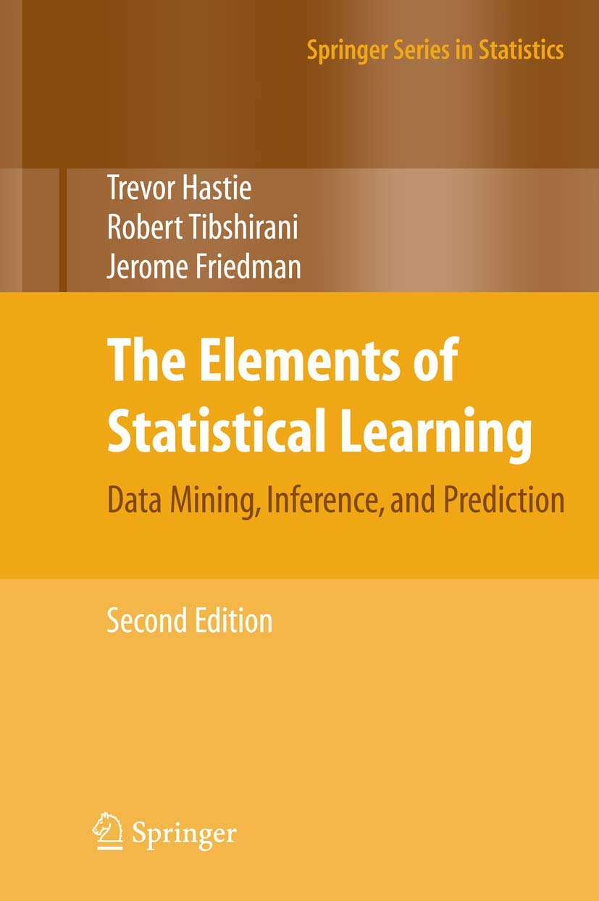

# ElemstatLearn-review

The Elements of Statistical Learning을 읽고 정리한 내용입니다.

## links
* textbook: <a href="https://web.stanford.edu/~hastie/ElemStatLearn/">https://web.stanford.edu/~hastie/ElemStatLearn/</a>

## Summaries

1. <a href="ch1. Intro/1. Introduction.md">Introduction</a> (12/14)
2. <a href="ch2. Supervised Learning/2. Overview of Supervised Learning.md">Overview of Supervised Learning</a> (12/14~1/18)
3. <a href="ch3. Linear Method for Regression/3. Linear Methods for Regression.md">Linear Methods for Regression</a> (1/19~2/8)
4. <a href="ch4. Linear Methods for Classification/4. Linear Methods for Classification.md">Linear Methods for Classification</a> (2/9~25)

## Additional Material

Presentation
1. <a href="ch2. Supervised Learning/presentation/ch2. Overview of Supervised Learning.pptx">ch2. Overview of Supervised Learning</a>
2. <a href="ch4. Linear Methods for Classification/CH4 Linear methods for classification - Logistic Regression.pptx">ch4. Logistic Regression</a>

Implementation
1. Newton-Raphson Method
