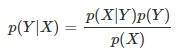

# 2. Overview of Supervised Learning

발표시간 30분 

## Reference

* RSS 미분

    <a href="https://math.stackexchange.com/questions/2387495/how-do-you-differentiate-a-matrix-equation-with-respect-to-a-vector">https://math.stackexchange.com/questions/2387495/how-do-you-differentiate-a-matrix-equation-with-respect-to-a-vector</a>

* function approximation

    <a href="https://machinelearningmastery.com/neural-networks-are-function-approximators/">https://machinelearningmastery.com/neural-networks-are-function-approximators/</a>

* Senarios

    <a href="https://stats.stackexchange.com/questions/81197/can-someone-please-explain-to-me-what-the-particular-scenarios-mean
">https://stats.stackexchange.com/questions/81197/can-someone-please-explain-to-me-what-the-particular-scenarios-mean
</a>

* eq_2.9-2.13

    <a href="https://kitech.tistory.com/6?category=793139">https://kitech.tistory.com/6?category=793139</a>

* 조건부평균

    <a href="https://datascienceschool.net/02%20mathematics/07.06%20%EC%A1%B0%EA%B1%B4%EB%B6%80%EA%B8%B0%EB%8C%93%EA%B0%92%EA%B3%BC%20%EC%98%88%EC%B8%A1%20%EB%AC%B8%EC%A0%9C.html">https://datascienceschool.net/02%20mathematics/07.06%20%EC%A1%B0%EA%B1%B4%EB%B6%80%EA%B8%B0%EB%8C%93%EA%B0%92%EA%B3%BC%20%EC%98%88%EC%B8%A1%20%EB%AC%B8%EC%A0%9C.html</a>

* Decision Theory

    <a href="http://sanghyukchun.github.io/61/">http://sanghyukchun.github.io/61/</a>

* eq_2.27~2.30

    <a href="https://wtfaretheysaying.wordpress.com/tag/esl/">https://wtfaretheysaying.wordpress.com/tag/esl/</a>

* MLE(Maximum Likelihood Estimate)

    <a href="https://hyeongminlee.github.io/post/bnn002_mle_map/">https://hyeongminlee.github.io/post/bnn002_mle_map/</a>

* smoothing spline

    <a href="https://godongyoung.github.io/%EB%A8%B8%EC%8B%A0%EB%9F%AC%EB%8B%9D/2018/02/14/ISL-Moving-Beyond-Linearity_ch7.html">https://godongyoung.github.io/%EB%A8%B8%EC%8B%A0%EB%9F%AC%EB%8B%9D/2018/02/14/ISL-Moving-Beyond-Linearity_ch7.html</a>

    <a href="https://cdm98.tistory.com/27">https://cdm98.tistory.com/27</a>     

* Kernel Smoothing Method

    <a href="https://lee-jaejoon.github.io/ESL-6/">https://lee-jaejoon.github.io/ESL-6/</a>

## 2.1. Introduction

input값을 통해 output값을 예측하는 일련의 과정인 'supervised learning'(지도학습)에 대해 알아보자.

## 2.2. Variable Types and Terminology

### type of variables

* Qualitative variable

    각 결과값들 간의 순서가 존재하지 않으며, 숫자나 값이 class 형태로 사용되는 경우. 이를 'categorical' or 'discrete'하다고 한다.

    * Usage for Input / output

        Input으로는 다차원의 categorical한 정보를 담기도 하는데, 이를 위해서 K-level한 변수를 각 컬럼으로 나누는 dummy variable을 생성하여 나타내기도 한다.

        이러한 정성적인 데이터가 output에 0 or 1(like code; died:0 / survived:1)과 같은 특정 결과로 나타나기도 한다.

* Qunatative variable

* Ordred Categorical

    각 Qualitative한 데이터에 대하여 순서를 띄는 경우를 말한다. (e.g. 대/중/소)

### problem definition type by data type

* Classification / Regression

    예측해야 할 결과 값에 따라 prediction problem의 명명이 달라진다. 일반적으로는 아래와 같이 분류한다.
* 'Classification': 정성적인 결과값을 예측하는 문제 
* 'Regression': 정량적인 결과값을 예측하는 문제

결과적으로 Classification이던 Regression이던 **function approximation**의 방법으로 추정가능하기 때문에 유사하게 접근 가능하다.

### Symbols for Input / Output

* X: Inputs (N rows, p vectors; NXp Matrix)
* Y: Quantative Outputs ($\hat{Y}$: prediction for output Y)
* G: Qualitative Outputs($\hat{G}$: prediction for output G)

## 2.3. Two Simple Approaches to Prediction: Least Squares and Nearest Neighbors

prediction method about
* linear model(by least squares)
* k-nearest neighbor prediction

### 2.3.1. Linear Models and Least Squares

Linear Model은 구조와 산출값이 안정적이라는 제약을 가하지만 잘못된 예측이 될 수 있는 방법이다.

Input X의 1열 p열까지의 feature)에 대해 output Y값을 예측하기 위한 식은 위와 같다. 는 intercept(계수)이고, ML에서는 bias(편차)라고 불린다. 이를 간편히 표현하기 위해 에 대응되는 input X를 1로 대응시키면 두번째 수식이된다.

Linear Model을 훈련 데이터를 통해 학습하는 방식 중의 대표적인 방법은 *least squares* 방식을 활용하는 것이다. 아래의 RSS(residual sum of square)를 최소로하는 계수(beta)값을 찾는 것이다.

RSS를 beta에 대한 2차식으로 볼 수 있고, 이를 최소화하는 beta를 계산하기 위해 미분을 수행한다.

RSS를 beta 측면에서 보면 2차식이기 때문에 최소로 하는 점은 항상 존재한다. RSS를 전치행렬과의 내적으로 표현할 수 있다. 그리고 RSS의 unique한 값을 찾기 위해 RSS를 beta에 대해 미분하면 두 번째 식이 나타난다.

 

그리고 가 <a href="https://datacookbook.kr/81"> 역행렬을 취할수 있는 nonsingular(정칙행렬)</a>이라면 RSS를 최소화하는 unique한 계수(beta) 값을 아래와 같이 나타낼 수 있다.

결과 분포를 살펴보면 일부 잘못 분류된 값들을 볼 수 있다. 만약 linear model에 가해지는 제약이 더 많다면 error를 줄일 수 있었을까?

#### Question

* Senario 1.

    훈련에 사용되는 데이터셋이 상호 feature들 간에 상관관계가 없고 다른 평균을 가지는 Gaussian 분포라면?

* Senario 2.

    훈련 데이터셋이 작은 분산을 가지는 10개의 Gaussian 분포의 혼합이며, 각각의 평균들이 Guassian 분포를 따르는 경우.

### 2.3.2. Nearest Neighbor Method

Least Square 방식에 비해 상대적으로 구조적인 제약이 덜한 방식.

Nearest neighbor 방식은 훈련셋 T의 관측치들을 활용하여 Y hat의 형태로 변환하여 오차를 줄여나가는 방식이다.

)는 샘플 내 특정 포인트 x에 인접한 k개의 이웃 포인트들을 말한다. 

k nearest neighbor의 계수의 개수에 따라서 decision boundary가 변화하는 것을 볼 수 있다. 15인 경우에는 Linear Model을 사용한 것보다 더 잘나타내는 것 같으며, 1인 경우에는 더 상세하게 구분하면서도 misclassification하는 경우가 발생하지 않는다.

### 2.3.3 From Least Squares to Nearest Neighbors

* Linear Model: 의사결정경계가 선형적인 것을 가정하고 예측을 위한 parameter(계수)를 학습한다. (low variance / high bias) 

* Nearest Neighbor: Linear Model과 달리, 사용하는 데이터에 어떤 제약사항도 없기 때문에 어떤 상황에서도 활용가능한 방법. 그러나 결정경계의 특정 지점은 input 데이터에 따라 불안정하다. (high variance / low bias)

## 2.4. Statistical Decision Theory

Quantitative output

는 random input vector로, Y는 을 만족하고 ) 값을 가지는 vector로 나타낸다. 정의를 바탕으로 input X를 받아 Y를 예측하는 함수 )를 찾는 것이 목적이다. 이를 위해, loss function ))를 찾는것이 중요하고 sqaured error loss )=(Y-f(X))^2)를 활용한다.

 
 
 

EPE를 계산함에 있어, 확률변수 Y의 기대값을 계산하는 것이다. 확률변수 Y의 기대값을 구하는데 있어서 조건부 확률밀도함수를 사용하여 계산하는 방법의 식을 정리하면 위와 같다.

EPE를 확률밀도함수의 정의로 변환하고, EPE를 최소화하게 되면, 목표로 하는 함수 f(x)가 예측을 잘하는 것이다. 따라서 argmin을 수행한다. 결과적으로 X=x일때의 Y가 이 값을 최소로 만들게 된다.

nearest neighbor에 대해서도 같은 접근 법으로 식을 간단히 하게 되면.

'Ave'는 평균을 나타내고, Nk(x)는 k지점에 인접한 데이터들의 집합을 나타낸다.

위와 같이 나타내는데 있어 두가지 가정이 존재한다.
* 기대값은 샘플데이터들의 평균으로 근사
* 한 포인트에 맞춰진다는 것은 그 포인트에 
가까워진다는 것을 의미

data size N과 neighbor size k에 대해 N이 크면 특정 포인트 x에 대해 많은 이웃들이 있게되고, k값이 클 수록 평균값은 더 안정적이게 된다. 따라서 N과 k가 크면 클수록 linear model에서 정의했던 EPE를 최소화하기 위한 y hat에 대한 식과 동일해진다.

만약 두 방법에 대해서 고차원 데이터셋이 활용되는 경우에는 어떻게 할것인가?

linear regression에서는 

위와 같이 f(x)식을 가정하여 모델링 한 후 계수 beta를 구할 수 있다.

결과적으로, least square와 nearest neighbor방식 모두 평균에 의해 조건부 기대값으로 추정했다(least square의 경우 모든 확률변수 X에 대한 Y의 기대값은 산술적인 평균과 유사하기 때문). 그러나 각각은 모델의 가정이 다르다.

* Least Sqaure: f(x)는 전역적으로 선형적인 함수를 띈다. - model-based
* Nearest Neighbor: 지역적인 상수함수에 의해 추정된다.

Nearest Neighbor방식이 더 간단하여 채택하기 좋아보이지만, "flexibility"를 위한 비용(범용성있는 모델을 사용하는)을 지불(가정을 부여)해야 한다.

가정을 부여하는 것에 대한 예시를 rigid linear model에 대응하여 살펴보자.

이는 선형모델에 <a href="https://stat.snu.ac.kr/heeseok/teaching/asm17/regression1-%EB%B0%9C%ED%91%9C.pdf">additivity 제약(가법성 가정)</a>을 부여했다. 

#### **가법성 가정**

반응변수에 대한 예측변수(Xj)의 효과는 다른 예측변수들의 값에 영향을 받지 않는다.

고차원 데이터를 가진 환경에서 조건부 기대값을 추정하는 문제를 위해서는 모델에 대해 임의의 제약을 추가해야 한다(such as additivity). 

Loss를 계산하는데 있어 2.11의 제곱을 활용한 L2 규제가 아닌, 절대값을 활용한 L1규제를 활용하면 어떻게 될까?

L1 규제는 L2규제 방식보다 더 탄탄하지만, 각 예측변수들의 도함수들이 불연속적으로 가정하기 떄문에 잘 사용되지 못한다.

### **categorical variable G**

다루는 model의 output이 카테고리 특성을 지닌 값이라면 어떻게 될까? 이를 위해 다른 loss function을 사용해야 한다. 

loss function은 K(G의 unique한 개수; 기수성) X K 행렬인 L로 나타낸다. L은 대각행렬에 대해서는 0이고, 모든 값들은 0이상의 값을 가진다. 그리고 L(k,l)은 관측치 class k를 l에 속하게 하는데 있어 지불하는 비용을 뜻한다. 그리고 loss를 산정함에 있어서 하나의 예측값(single unit)에 대한 misclassification을 측정하는 zero-one loss function을 활용한다. 따라서 이에 대한 EPE는 아래와 같이 나타낼 수 있다.

이를 위해 가장 적절한 방법은 conditional distribution Pr(G|X)를 활용하여 가장 가능한 클래스를 분류하는 '베이즈 분류기'를 사용하는 것이다.

**Bayes Classifier**

어떤 분류 문제에서, 사전확률 P(C1),P(C2)만 알고 있을때  어떻게 가장 합리적인 판단을 할 수 있을까? 그떄는 상대적으로 높은 확률을 지닌 클래스를 선정하는 것이다.

그러나 문제는 이 결정에 대한 error는 항상 0.4이고 classification result는 항상 C1이 될 것이다. 그래서 이를 더 발전시키기 위해서는 다른 정보 또한 필요하다.

우리가 목표로 추구하는 데이터 X에 대한 클래스를 분류하는 확률 P(C1|X),P(C2|X)은 likelihood에 대한 정보를 가지고 있다면 더 발전할 수 있다. 이 정보를 알고 있다면 베이즈 정리에 의해 P(C1|X),P(C2|X)를 구할 수 있기 때문이다.

특정 sample Xi에 대해서 어떤 class를 택할지는 아래와 같이 나타낼 수 있게 된다.

## 2.5 Local Methods in High Dimensions

위에서 살펴본 대표적인 2가지 prediction model
* stable: 'biased Linear model'
* less stable: 'less biased class of k-nearest neighbor'

NN방식으로 최적의 조건부 평균을 찾을 수 있는 이유는 관측치에서 neighbor의 수를 크게 잡기 때문이다. 그러나 이는 고차원으로 확장되는 순간 무너진다. 이를 차원의 저주라고 하며, 이로 인해 발생하는 문제점들을 살펴보도록 하자.

1. 이웃들간의 거리가 점차 증가하는 현상

    NN에 사용되는 uniformly distributed input을 p차원의 hypercube의 형태로 나타내면 아래의 그림과 같다. 그리고 관측치들의 일부 r을 포착하기 위해 target point에 대한 표현을 hypercubial 하게 나타내자. 이는 단위 부피의 r 파편으로 대응되어 expected edge의 길이를 =r^{1/p})로 나타낼 수 있다.

    1% or 10%의 데이터를 local average 핼태로 나타내면 전체 input data의 63% or 80% 정도만을 커버하게 되므로 더이상 이웃들이 "local"하다고 할 수 없게 된다. 따라서, avg하는데 있어서 수행하는 sample의 수가 작으면 학습시에 variance가 커진다는 것을 알 수 있다.

2. sample point가 edge of sample point로 퍼지는 현상

    N data point를 p차원의 단위 구에 원점으로부터 uniform distribute하게 나누어 두었다고 하자. 그리고 origin에서부터 nearest neighbor를 추정한다고 가정했을때, 원점에서부터 각 data point까지의 거리는 아래와 같이 계산할 수 있다.

    

    i.e) N=500, p=10, d(p,N) ~ 0.52; 따라서, 대부분의 data point가 다른 data point에 비해 sample space의 경계에 더 가까이 있음을 알수 있다. 이때문에, 경계 근처에 있는 training sample에 대해서는 예측이 더 어려워질 수밖에 없다(via extra/interpolate). 

3. sampling density의 변화 (to, )

    if, single input problem에 대해 100개의 dense sample이 필요하다고 하자. 이를 10개의 input problem에 10개의 차원으로 확장한다면, 100의 10승개의 dense sample이 필요하게 된다. 따라서 고차원에서는 학습에 필요한 샘플들이 input공간을 sparse하게 채우게 된다. 

4. wrap-up

    1000개의 data sample을 [-1,1]^p의 형태로 생성하고, x에 대한 좌표 Y를 도출하는 수식은 아래와 같다.

    

    간단히 생각하기 위해 1-NN의 규칙으로 x0인 점에 대하여 y0를 예측한다. 그리고 MSE Error를 x0인 점에 대하여 계산한 식은 아래와 같다.

    

    
    

    위의 수식은 임의의 nearest neighbor문제에 대해 x0일때의 f(0)를 추측하기 위한 MSE 수식이다.

    

    
    

    MSE문제를 Variance와 Squared bias로 나누어 살펴볼 수 있다. 이를 'bias-variance decomposition'이라고 하는 유용한 접근 법이다. 위에서 variance는 1-nearest neighbor임으로 N(sample size)가 1000이면 Error는 bias와 variance모두 작기 때문에 0과 밀접하게 가까워질 것이다(right-bottom).  

    차원이 커질수록 NN은 target point에서 점점 멀어지는 경향이 있어 bias와 variance는 모두 증가하게 된다. p가 10일때는 샘플 중에 99%가 원래 지점보다 0.5 distance이상 멀어져있게 된다(left-bottom). 따라서 p값이 증가하면 추정치는 0이 될 것이며, p값이 감소한다면 MSE level은 분산과 마찬가지로 1.0에서 떨어지며 vairance도 떨어질 것이다.

### Bias-Variance Decomposition

하나의 target function f(x)의 각 data point는 beta + weight x0이나, 이는 하나의 분포에 대한 기대값을 point로 계산한 것이다. 

5. overcome curse of dimensionality in linear model

    예제들이 극단적이지만, 일반적으로 살펴보자. 많은 변수를 가진 함수가 복잡해지는 것은 차원의 복잡도를 높이는 것과 동일하다. 그런데도 낮은 차원에서 학습시키는 것과 동일한 수준의 결과를 얻으려면 학습에 사용되는 데이터셋도 그와 같이 많아져야한다.

    위의 2.7. 예제의 function을 linear한 함수에 대해 예제를 변환하여 살펴보자.

    우선, (2.25)의 x0에 대한 MSE식에 Y를 (2.26)의 식으로 대체하자. 

    

    linear model에서 X값을 최소로 하는 계수를 계산할때, 계수는 (2,6)의 식과 같이 나타남을 알 수 있었다. 

    

    해당 식에 (2.26)의 y에 식을 적용한다.

    

    그렇게 되면 예측되는 계수(beta hat)는 위와 같아지며, 계산한 beta hat을 임의의 x0와 y hat 0의 식에 대입하면 y hat 0를 이와같이 나타낼 수 있고, 이렇게되면 y와 y hat의 기대값이 Xbeta로 동일해진다.

    y와 y hat의 기대값이 값다는 것을 가지고 x0에 대해 EPE를 계산할 수 있게 된다.

    결과적으로 bias는 EPE에 전혀 영향을 미치지 않고 variance만 분포의 표준편차에 의해 영향을 받는것을 알 수 있다.

    

    
    

    추가적으로 N이 크고 T가 랜덤한 방식으로 추출되면 E(X)=0이고 i컬럼과 j컬럼 간에는 상관관계가 없으며 둘 간의 분산이 동일하면.XTX -> NCov(X)로 변환할 수 있게 된다.

    

    

    (2.28)식에 의해 EPE의 기대값은 차원 parameter p에 의해 sigma^2/N 만큼 선형적으로 증가함을 알 수 있다. N이 크고 sigma^2이 작다고 가정하였기 떄문에 variance가 증가하는 것은 무시 가능하다. 

    이렇게 강력한 제약들을 가함으로써 차원의 저주를 극복할 수 있게 된다.

    1-NN의 식을 Least Sqaure방식으로 loss를 산정할때 대상 식 f(x)를 1차식과 3차식으로 적용했을 때 차원의 변화에 따른 EPE값의 변화 추이를 보자.

    

## 2.6. Statistical Models, Supervised Learning and Function Approximation

목표는 input과 output을 활용하여 f(x)에 더 가까운 근사를 하는 f(x) hat을 추정하는 것이다. linear model에서 결과적으로 추론한 regression function은 모든 데이터 X에 대하여 얻을 수 있는 기대값으로 나타난다. 그리고 nn방식에서도 조건부 기대값을 활용하여 추정할 수 있었다.

그러나 이는 아래의 두 상태에서는 불가능하다.

1. Input space의 차원이 너무커서, nn이 target point에 근접하지 못하는 경우 큰 error를 만들 수 있다.

2. bias와 variance를 동시에 줄이는 special structure를 찾은 경우

해당 챕터에서는 차원의 문제를 극복할 수 있는 방법을 prediction problem에 적용하여 살펴본다.

### 2.6.1. Statistical Model from the Joint Distribution Pr(X,Y)

데이터가 위와 같은 통계적 모델을 통해 나타난다고 가정하자. 그리고, =E(Y|X=x)) 이며, f(x)의 조건부 평균을 나타내는데 있어 Pr(Y|X)는 X에 대해 전제를 우선한다.

addtive model(오차를 더하는 모델)은 추정하는데 유용하다. 대부분의 모델이 (X,Y)의 pair에 대해 절대적으로 Y=f(x)의 관계를 가지지 않기 떄문이다. 일반적으로 Y에 기여하는 measurment error가 있다는 것이다. addictive model은 이러한 내용을 e로 나타내는 것이다.

(2.29)식에서 error가 i.i.d라는 가정은 무조건 필요로 하지 않지만, EPE의 가정 중에 squared error를 일정하게 average하는 가정을 떠올리게 한다. 이렇게 uniform average한 가정이 model estimation에 있어 (2.1)의 수식을 활용하게 하는 것이다.

quantative response를 더 다뤄보면, Additive error는 qualitative output G에는 활용되지 않는다. qualitative 문제에서 p(X)는 Pr(G|X)를 활용하여 나타낸다.

### 2.6.2. Supervised Learning

Y=f(X)+e라는 형태를 가진 수식에서 지도학습은 (x1,y1),...,(xn,yn)의 결과값을 가지고 x값을 학습에 투입함으로써 알고리즘을 학습시킨다. 그리고 f(xi) hat을 반응으로 생성하고 실제값과의 오차를 활용하여 이를 줄여나가며 결과적으로 실제로 다른 데이터에서도 이 오차가 줄어들 수 있도록 학습한다.

### 2.6.3. Function Approximation

2.6.2. 절의 approach를,

* to, ML and AI - supervised learning
* to, math and stats - function approximation and estimation

p+1 차원의 유클리디안 공간에 {xi,yi} data point를 나타내면, function f(x)에 의해 yi=f(xi)+ei로 매핑할 수 있다. domain은 p차원의 유글리디안 공간 R^p에 나타난다. Function Approximation의 목표는 R^p의 모든 x에 대해 적절한 f(x) approximation을 하는 것이다.

function approximation 방식은 유클리디안 공간의 위치적인 개념과 확률 추론의 수학적인 개념을 문제에 적용하는 것이다.

확률 추론에서 조정해야할 파라미터 Theta는 데이터에 따라서 수정된다. 예를들어 linear model에서의 파라미터 Theta는 계수(beta)가 되는 것이다.

hk는 input vector에 가하는 function 또는 변환의 set을 말하며, 다양한 것들이 있지만 nonlinear expansion에 대해서는 sigmoid transformation을 들 수 있다.

그리고, apporximation해야하는 f의 파라미터 Theta를 추정하기 위해서 linear model은 RSS를 활용한다.

p=2인 차원에 대응하는 데이터로 f(x)를 표현하면 위의 그림과 같이 나타난다. additive noise에 의한 output noise 좌표는 그림과 같이 나타난다. 그리고 가능한 관측치에서 가까운 학습된 표면을 통해 파라미터 set을 찾아낸다. 이때 closeness를 판별하는 지표가 RSS이다.

RSS가 간편한 방법이긴 하지만 모든 상황에 들어맞는 유일한 criterion은 아니다. 추정을 위한 일반적인 방법론은 'maximum likelihood estimation'이다.

'maximum likelihood estimation'의 가정은 reasonable한 Theta값이 관측된 샘플들의 확률들 중에서 가장 크다는 것이다(평균을 나타내는 것?). 'maximum likelihood estimation'에서는 Least Sqaure 방식과 같은 오차를 최소화하는 식을 아래와 같이 나타낼 수 있다.

이는 예측한 값을 평균으로 하고, sigma를 표준편차로하는 분포로 나타내는 것과 동일하다.

#### Maximum Likelihood Estimation

만약, 키를 가지고 몸무게를 예측해야 하는 문제를 받았다고 생각하자. 이를 위해 parameter w를 가지고 키를 넣으면 몸무게를 반환하는 함수 y(x|w)함수를 정의할 수 있으며, 이것이 실제값과 가깝게 나오도록 w를 조정해야 한다. 파라미터 w는 회귀식의 계수와 편향을 모두 합쳐서 부를 수 있다.

그러나 우리의 예측값 y(x|w)는 실제값 t와 완전히 같다고 말할 수 없다. 따라서 t를 표현하기 위해 수학적으로 아래와 같이 표현할 수 있다.

"실제 몸무게(t)는 random variable이며, 예측한 몸무게 y를 평균으로 하며 특정값 sigma를 표준편차로 하는 '정규분포'를 따른다고 표현할 수 있다."

 

위의 말은 y(x|w)를 평균으로, sigma를 표준편차로하는 분포를 나타내는 식으로 표현할 수 있으며,

이는 위의 식과 같은 수식으로 나타낼 수 있다.

w와 sigma는 parameter이기 때문에 식을 아래와 같이 생략하여 표현한다.

p(t|x)는 키가 x일때, 실제 몸무게가 t일 확률을 말한다. 주어진 모든 데이터 D의 데이터포인트들에 대해 수식을 나타내면 아래와 같다(모든 데이터 포인트들은 독립이라고 가정). 

위의 수식을 살펴보았을때, 모든 Data point에 대한 확률은 parameter w에 따라 달라질 수 있음을 알 수 있다. 따라서 이를 p(D|w)로 나타낼 수 있다.

결국 우리가 예측해야 하는 모델은 모든 데이터포인트들에 대응되는 p(D|w)를 최대로 하는 모델이다. 그리고 이 때의 w를 찾아야 한다. 여기서 p(D|w)이며, 이 방식을 Maximum Likelihood Estimation이라고 한다.

**그렇다면 왜 log를 취하는 것일까??**

이는 계산의 용이성을 위함이다.

기존 likelihood estimation에 log를 취해도 크기상의 문제는 발생하지 않는다. 그리고 log를 취함으로써 production 연산을 summation 연산으로 바꿀 수 있다. 그리고 위의 식에서 sigma와 pi는 상수 값이므로 최대화 해야하는 대상만을 정리하면 아래와 같다.

그리고 위의 식은 예측 값과 실제 값의 차이의 제곱 L2 Loss이다. 따라서, MLE를 최대화한다는 것은 실제값과 예측값의 오차를 줄인다는 것과 동일한 의미임을 알 수 있다.

## 2.7 Structured Regression Models

NN과 같은 여타 ML방법들이 고차원에서 발생하는 문제에 대해서 살펴보았지만, 저차원에서도 data를 더 효율적으로 사용하는 'structured apporach'에 또한 적절치 못할 수 있다.

### 2.7.1. Difficulty of the Problem

(2.37)을 최소화하는 방법은 굉장히 많다. 특정 방법은 train case에 수행했던 것과 달리 test case에서는 poor predicator가 되는 경우가 있다.

(2.37)의 finite N에 대해 적절한 결과 값을 얻기 위해서는 위의 식에 적절한 규제가 필요하다. 이렇게 규제가 된 function을 로 표현할 수있다. 그러나 이러한 규제가 불확실성을 완전히 없애주는 것은 아니다. 그러나 다양한 규제를 통해 unique solution을 도출할 수 있으며, 이러한 모호성은 제약으로 인해 간단히 바뀔 것이다

이러한 제약은 어떤 metric을 사용하는지에 따라 달라질 수 있다(i.e. local regression, tree-based, metric, size of neightborhood ...). 

## 2.8. Classes of Restricted Estimator

결정 경계를 결정함에 있어서 제약을 부여하는 파라미터들의 종류

### 2.8.1. Roughness Penalty and Bayesian Methods

"Roughness Penalty"를 적용한 RSS 식은 위와 같다. 페널티를 적용하는데 사용하는 J(f) function은 input 공간의 좁은 일부 공간에서 급격하게 달라자는 함수인데, 가장 대표적인 함수는 'cubic smoothing spline'이다. 이를 least-sqaure 방식에 도입한 수식은 아래와 같다.

Roughness는 함수 f의 2차 도함수로 표현되고 그 크기는 lambda로 결정된다. lambda가 0이면 penalty가 없고(이렇게 추정한 f(xi)는 too flexible and overfitting), 무한대라면 linear한 값만 허용된다.

#### Smoothing splines

위의 (2.37)식에 대해서 RSS를 최소화하는 f(x)를 계산시 f에 아무런 제약이 없다면 단순히 모든 관측된 데이터에 완벽하게 적합하는 n-1차 식을 만들 수 있다. 이는 과대적합의 문제가 발생하기 떄문에 RSS가 작으면서 어느정도의 smooth를 가지는 함수 f(xi)를 찾아야 하는것이다.

smooth를 보장하기 위한 수식은 여러가지가 있지만, 그 중에서 'cubic smoothing spline'
을 활용한 (2.39)의 식을 예로 든 것이다.

### 2.8.2. Kernel Methods and Local Regression

Kernel Method 방식은 다른 추정방식들이 임의의 형태를 따름을 가정하고 추정하는 것과 달리 주변 데이터의 값을 활용하여 분포를 추정하는 방식을 말한다.

Gaussian density function을 기반으로 한 weighted function을 가지는 Gaussian Kernel을 예로 들어보자. 이때, weight는 x0부터의 유클리디안 거리를 제곱한 것의 지수만큼 멀어지게 된다. lambda는 Gaussian density의 variance로 대응되고 이웃간의 너비를 결정한다. Kernel 추정의 간단한 형태는 Nadaraya-Watson weighted average이며, 

local regression에 대해서는 아래와 같이 정의할 수 있다.

f[Theta]는 low-order polynomial 식인데, 상수식인지 아닌지에 대해서 다른 model을 위한 추정으로 정의할 수 있다.

### 2.8.3. Basis Functions and Dictionary Methods

해당 접근법은 선형 및 다항식과 접점이 있는 방식이지만 다양한 더욱 더 flexible한 중요한 모델들과 관련이 있다. 

기저함수를 통해 나타낸 선형관계식안 아래와 같다.

h는 input x에 대한 함수이며, 선형성은 Theta를 통해 나타나고 다항식은 m의 개수에 의해 나타난다.

## 2.9 Model Selection and Bias-Variance Trade off

모든 모델은 smoothing / complexity parameter를 가진다. 이 parameter는 아래의 요인들에 의해 결정된다.

* 페널티의 가산
* 커널의 너비
* 기저 함수의 수

smoothing spline 방식에서 lambda의 값에 따라 직선에서부터 y와 일치하는 곡선을 따른다. 그리고 local degree m polynomial model에서는 m의 크기를 무한대로 두면 global polynomial하며, 0으로 갈소록 y와 일치하는 곡선이 된다.

이는 RSS를 파라미터를 결정하는데 있어서 사용할 수 없다는 것을 알 수 있다. 왜냐하면 모든 경우에 y와 동일한 직선인(interpolate) 파라미터로 수렴할 것이기 때문이다.

k-nearest-neighbor에 대해 Expected Prediction Error를 계산하면 식은 위와 같다. 그리고 편이성을 위해 하나의 data point x0에 대해서 수식을 표현한다((l)은 x0와 인접한 이웃들을 의미한다.).

sigma 제곱은 새로운 test target의 variance와 관련된 에러로 줄일수 없는 에러이다.

f(x0)추정에 있어 f(x0) hat의 MSE는 bias와 variance component로 나눌 수 있다. bias는 실제 f(x0)의 평균과 추정치의 기대값의 차이로 계산된다. 이 값은 k값이 증가하면 같이 오르는 추세를 보인다. k값이 작다면 일부 이웃들만 f(x(l))에 있기 떄문에 f(x0)와 근접해진다.

varaince는 평균의 variance를 뜻하며, k 값과 반대로 움직인다. 따라서 k값이 달라짐에 따라 bias-variance tradeoff가 발생하는 것이다.

그리고 일반적으로 모델의 복잡도가 높으면 variance가 높아지고 bias가 낮아지게 되며, 복잡도가 반대로되면 그 둘간의 관계도 바뀌게 된다.

일반적으로 variance와 bias를 적절히 조정하여 최적의 test error값을 도출해야 한다. 이때 그림 2.11과 같이 train error가 하나의 척도가 될 수 있지만 적절치는 못하다.