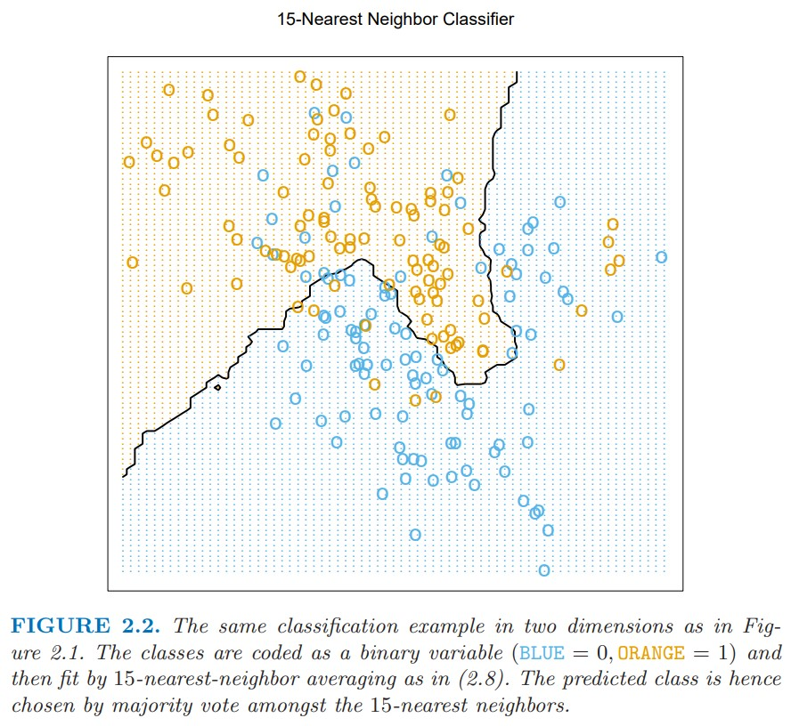

# 2. Overview of Supervised Learning

## 2.1. Introduction

input값을 통해 output값을 예측하는 일련의 과정인 'supervised learning'(지도학습)에 대해 알아보자.

## 2.2. Variable Types and Terminology

### type of variables

* Qualitative variable

    각 결과값들 간의 순서가 존재하지 않으며, 숫자나 값이 class 형태로 사용되는 경우. 이를 'categorical' or 'discrete'하다고 한다.

    * Usage for Input / output

        이러한 정성적인 데이터가 output에 0 or 1과 같은 특정 결과로 나타나기도 한다.

        그리고, Input으로는 다차원의 categorical한 정보를 담기도 하는데, 이를 위해서 K-level한 변수를 각 컬럼으로 나누는 dummy variable을 생성하여 나타내기도 한다.

* Quantitative(정량) / Qualitative(정성) Output

    예측해야 할 결과 값에 따라 prediction problem의 명명이 달라진다. 일반적으로는 아래와 같이 분류한다.
    * 'Classification': 정성적인 결과값을 예측하는 문제 
    * 'Regression': 정량적인 결과값을 예측하는 문제

* Ordred Categorical

    각 Qualitative한 데이터에 대하여 순서를 띄는 경우를 말한다. (e.g. 대/중/소)

* Symbols for Input / Output

    * X: Inputs 
    * Y: Quantative Outputs ($\hat{Y}$: prediction for output Y)
    * G: Qualitative Outputs($\hat{G}$: prediction for output G)

## 2.3. Two Simple Approaches to Prediction: Least Squares and Nearest Neighbors

### 2.3.1. Linear Models and Least Squares

Linear Model은 구조와 산출값이 안정적이라는 제약을 가하지만 잘못된 예측이 될 수 있는 방법이다.

Input X의 1열 p열까지의 feature)에 대해 output Y값을 예측하기 위한 식은 위와 같다.

는 intercept(계수)이고, ML에서는 bias(편차)라고 불린다. 이를 간편히 표현하기 위해 에 대응되는 input X를 1로 대응시키면 아래와 같은 수식이된다.

결과값 y hat은 scalar 값이며, 대부분 K개의 element를 가지는 vector가 된다(편차 및 계수들의 개수가 K개 이기 때문). 따라서 편차벡터는 pXK가 될것이다. 

p-차원의 input space를 가지는 function =X^T{\beta})에 대해 X에 대한 미분은 =\beta)이며 경사의 방향을 나타낸다.

Linear Model을 훈련 데이터를 통해 학습하는 방식 중의 대표적인 방법은 *least squares* 방식을 활용하는 것이다. 아래의 RSS(residual sum of square)를 최소로하는 beta값을 찾는 것이다.

RSS를 beta 측면에서 보면 음의 2차식이기 때문에 최소로 하는 점은 항상 존재한다. 그러나 이것이 최소지점을 뜻하는 것은 아니다.

RSS를 Matrix 표기법에 따라 나타내고, beta를 정규식에서 얻음에 따라 다르게 나타내면,

 

그리고 가 <a href="https://datacookbook.kr/81">nonsingular(정칙행렬)</a>이라면 아래와 같이 나타낼 수 있다.

X matrix에서 i번째 input에 대한 결과값은 이와 같이 나타낼 수 있다. =x_i^T\hat{\beta}).

결과 분포를 살펴보면 일부 잘못 분류된 값들을 볼 수 있다. 만약 linear model에 가해지는 제약이 더 많다면 error를 줄일 수 있었을까?

* Senario 1.

    훈련에 사용되는 데이터셋이 상호 feature들 간에 상관관계가 없고 다른 평균을 가지는 Gaussian 분포라면 어떻게 되었을까?

* Senario 2.

    만약 훈련 데이터셋이 작은 분산을 가지는 Gaussian 분포의 혼합이며, 각각의 평균이 Guassian 분포를 따르는 경우.

### 2.3.2. Nearest Neighbor Method

Nearest neighbor 방식은 input space x를 Y hat의 형태로 변환하여 나타내었을 때 훈련셋 T에서 관측되는 관측치들을 활용하는 방법이다.

)는 특정점 x에 인접한 k개의 인접한 샘플들에 의해 결정된다. 그리고 k개의 샘플을 가지고 결과를 평균하여 return한다.

k nearest neighbor의 계수의 개수에 따라서 decision boundary가 변화하는 것을 볼 수 있다. 15인 경우에는 Linear Model을 사용한 것보다 더 잘나타내는 것 같으며, 1인 경우에는 더 상세하게 구분하면서도 misclassification하는 경우가 발생하지 않는다.

그러나 학습해야할 파라미터의 수를 따지고 본다면, k-neareset neighbor는 N/k이며, Linear Model은 p인데, 이는 k의 수가 증가/감소함에 따라 달라지지만 일반적으로 Linear Model이 파라미터의 수가 많다.

그리고 학습을 진행하는데 있어 sum-of-square방식을 사용하지 못하는 이유는, k=1인 경우에는 error가 0이기 떄문에 항상 k=1을 선택할 것이기 때문이다.

### 2.3.3 From Least Squares to Nearest Neighbors

* Linear Model: low variance / hight bias 

* Nearest Neighbor: high variance / low bias 

## 2.4. Statistical Decision Theory

를 random input vector로, 을 random output vector로, )를 서로 교차하는 확률로 나타내자. 정의한 표기를 바탕으로 input X를 받아 Y를 예측하는 함수 )를 찾는 것이 목적이다.

이를 위해 loss function ))를 찾는것이 중요하며, 이를 위해 sqaured error loss )=(Y-f(X))^2)를 활용한다.

 
 
 

어느 x값에 대해서 Y의 best prediction은 <a href="https://datascienceschool.net/02%20mathematics/07.06%20%EC%A1%B0%EA%B1%B4%EB%B6%80%EA%B8%B0%EB%8C%93%EA%B0%92%EA%B3%BC%20%EC%98%88%EC%B8%A1%20%EB%AC%B8%EC%A0%9C.html">조건부평균</a>이다.

nearest-neigbor에서는, 각 x점들에 대해 y들의 평균을 활용하여 나타낼 수 있다.

** 선형 또는 더 구조적인 model이 적합한 경우 k-nearest neighbor방식보다 안정적인 추정치를 얻을 수 있다.

???????????????

=====================

**결과적으로 nearest neigbor와 least square 방식 모두 average를 거친 조건부평균으로 나타낼 수 있다.**

L2 규제를 적용한 (2.11)식을 L1 규제를 적용한 식으로 변형하면 어떻게 될까?

### categorical variable G

이를 위해 가장 적절한 방법은 conditional distribution Pr(G|X)를 활용하는 '베이즈 분류기'를 사용하는 것이다.

## 2.5 Local Methods in High Dimensions

* stable: 'biased Linear model'
* less stable: 'less biased class of k-nearest neighbor'

조건부평균을 활용하여 average로 nearest neighbor방식과 least square 방식을 나타내는것은 고차원으로 확장되는 순간 무너진다. ('차원의 저주')

차원의 저주 문제 1.

Since this corresponds to a fraction r of the unit volume,
the expected edge length will be ep(r) = r1/p. In ten dimensions e10(0.01) =
0.63 and e10(0.1) = 0.80, while the entire range for each input is only 1.0.
So to capture 1% or 10% of the data to form a local average, we must cover
63% or 80% of the range of each input variable. Such neighborhoods are no
longer “local.”

https://datapedia.tistory.com/15

fraction r을 낮춰봤자 차원의크기가 높다면 local하지 못하다.

고차원에서 sparse sampling 방식의 결과는 모든 sample 포인트들이 샘플의 edge와 가까워진다는 문제.

median distance로 측정해보았을때, boundary로 더 가까워진다는 사실을 확인.
이는 예측을 더 어렵게 만들기 때문에 큰 문제가 된다.

차원의 저주 문제 2.

샘플링 밀도의 변화. (to. )

 차원의 크기가 클수록 같은 샘플의 수라도 차원이 낮은 수준의 샘플링 밀도를 맞추기 위해서는 더 많은 input이 필요하다.

위의 nearest neighbor 오차 계산식에서, 차원의 수가 점점 늘어날 수록, target point에서 점차 멀어지기 시작한다. 따라서 variance와 bias가 점차 늘어나는 것이다.

차원의 수가 10만늘어나도 99%의 샘플이 원래값보다 0.5 distance가 멀어져있다.

**차원의 수가 늘어날 수록 이를 충족시켜야하는 샘플의 수가 많아져야 한다는 것.**

for nearest neighbor

for least square

 

차원 p는 \sigma^2 / N의 경사로 증가하고, N이 엄청나게 크고 sigma가 작다면, 차원의 증가는 무시가능하므로, 이러한 제약을 활용하여 차원의 저주를 탈출할 수 있다. 

## 2.6. Statistical Models, Supervised Learning and Function Approximation

model의 목표는 input과 output을 활용하여 f(x)에 더 가까운 근사를 하는 f(x) hat을 추정하는 것이다.

nearest neighbor는 조건부평균을 통해 추정하고, sqaured loss는 regression function으로 추정한다. 그러나, 추정하는데 있어서 두 가지 경우에는 문제가 발생

1. 차원이 너무 크면, 이웃간의 간격이 실제 target point와 멀어져 error를 유발
2. 특정 structure에서는 bias와 variance를 동시에 줄이는 것이 가능하다는 것

### 2.6.1. Statistical Model from the Joint Distribution Pr(X,Y)

데이터를 위와 같은 통계적 모델을 활용하여 나타내자. =E(Y|X=x)) 이며, 조건부확률은 조건부 평균 f(x)를 통해 X에 대해서만 의존적이다.

addtive model(오차를 더하는 모델)은 추정하는데 유용하다. 대부분의 모델이 (X,Y)의 pair에 대해 Y=f(x)의 관계를 가지지 않기 떄문이다. 일반적으로 Y에 기여하는 measurment error를 포함한 보이지 않은 변수들이 있다.

그리고 대부분의 ML 분류 문제는 위의 함수 양식을 따른다. 

### 2.6.2. Supervised Learning

Y=f(X)+e라는 형태를 가진 수식에서 지도학습은 (x1,y1),...,(xn,yn)의 결과값을 가지고 x값을 학습에 투입함으로써 알고리즘을 학습시킨다. 그리고 f(xi) hat을 반응으로 생성하고 실제값과의 오차를 활용하여 이를 줄여나가며 결과적으로 실제로 다른 데이터에서도 이 오차가 줄어들 수 있도록 학습한다.

### 2.6.3. Function Approximation

학습의 문제를 함수추정으로 정의하는 것은 유클리디안 공간의 위치기반의 개념과 수학적인 확률 추정으로 문제를 적용하도록 만들었다. 

maximum likelihood 

http://sanghyukchun.github.io/58/