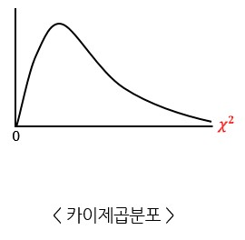
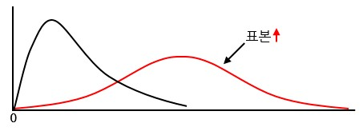
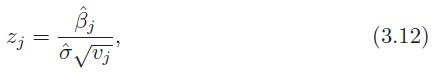
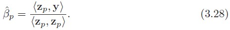
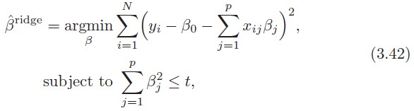
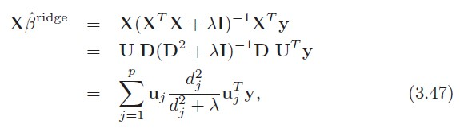

# 3. Linear Method for Regression

## caution

except for 3.7. ~ the end

## 3.1. Introduction

Linear Method는 과거부터 현재까지 널리 쓰이는 모델이다. 그리고, input이 output에 어떤 영향을 미치는지 설명하는 것이 쉬우며, training case가 적거나 signal-to-noise 비율이 낮거나 sparse data인 경우에는 non-linear 모델보다 성능이 좋다.
마지막으로, input 값들의 단위를 변환시키는데 사용되며 이를 'basis-function method'라고 부른다.

## 3.2. Linear Regression Models and Least Squares

기본적인 단순선형회귀에서 다항선형회귀로 그리고 output의 개수를 늘린 다항선형회귀로 어떻게 확장할 수 있는 지 탐구하는 절.

선형모델은 p개의 feature())를 가지는 위의 수식으로 표현할 수 있다.

Xj로 위치할 수 있는 Data source

* quantitative inputs
* transformations of quantitiative inputs, such as log, squared-root or square
* basis expansions, such as , leading to a polynomial representation
* numeric or "dummy" coding of the levels of quantitative inputs
* interactions between variables

Trainin data는 (x1,y1)의 쌍으로 ... (Xn,yn)과 같이 N개의 datapoint로 구성되어 있으며, 하나의 datapoint i에 대해서는 (xi1,xi2,...,xip)와 같이 p개의 column 값으로 구성된다. 그리고 estimation을 통해 추측해야 하는 beta의 값 또한 beta = (b0,b1,...bp)의 와 같이 구성된다.

beta를 estimation 하기 위해 가장 유명한 접근 방법은 RSS 방식이며, 이는 아래와 같다.

training observation (xi,yi)는 모집단으로부터 random(임의로)하게 추출되는 것이 바람직한 방법이다. **그러나 xi가 임의로 추출되지 않더라도 yi가 주어진 xi에 대해 conditionally independent하다면 여전히 RSS 방법은 유효하다.**

====================================

### conditional independent

<a href="http://norman3.github.io/prml/docs/chapter08/2.html">http://norman3.github.io/prml/docs/chapter08/2.html</a>

세 개의 변수 a, b, c가 있다.
* 이 때 b와 c가 주어졌을 때 a에 대한 조건부확률을 계산해보자.
* a가 b에 독립적이라면 다음과 같은 식이 성립한다.
    
    

    위의 경우를 c가 주어졌을 때 a는 b에 대해 조건부 독립이라고 표현한다.

* 이런 상황에서 c가 주어진 상태의 a와 b의 결합 분포는 다음과 같다.

    

    이를 조건부 독립이라고 하고, 다음과 같이 표기한다.

    

확률 변수의 조건부 독립여부는 중요한 속성이다.
* 사용되는 모델을 단순화시킬 수 있고,
* 학습에 필요한 연상량을 낮출 수 있다.

====================================

eq 3.2.는 linear model 3.1.에서 아무런 가정이 없는 수식이지만 Least square 방식으로 어느 정도는 fitting 가능하다.

X를 N X (p+1) matrix로, y를 N vector로 구성된 훈련셋의 output으로 따져볼 때, 어떻게 3.2. 식을 최소화할 수 있을까?

3.3. 식을 beta에 대한 2차원식으로 나타내면, RSS를 최소로하는 beta를 계산하기 위해 beta에 대한 1차 및 2차 편미분을 식으로 나타내면 3.4.와 같다.

**X를 full column rank로 가정**하면 는 양의 값을 가지고 1차 미분에 대해 0으로 하는 식은 아래와 같다. 

그리고 이를 unique하게 하는 beta의 값은 위와 같다.

input vector x0에 대한 예측값은 =(1:x_0)^T\hat{\beta})로 나타낼 수 있으며 training input으로 feat된 값은 위의 수식과 같다.

^{-1}X^Ty)는 y에 hat을 붙이기 위한 Matrix로 "hat" matrix라고도 불린다.

위의 그림은 least square 추정을 기하학적으로 나타내었을 때의 그림이며, x0는 1로 가정한 상태에서 x1과 x2 그리고 y에 대한 3차원 공간으로 투영했다. x1과 x2의 부분공간에 y의 직선이 추정치 y hat과 직교하도록 RSS를 최소화하는 beta를 찾아야 한다.

====================================

### rank and dimension in Linear algebra

<a href="https://losskatsu.github.io/linear-algebra/rank-dim/#">https://losskatsu.github.io/linear-algebra/rank-dim/#</a>

X의 컬럼들이 선형 독립이 아닌 경우(bot of full rank)가 발생할 수 있다(i.e. x2 = 3x1). 이 경우에는 는 singular(역행렬을 가지지 않음)이며, least square의 beta hat은 unique한 값을 가질 수 없게 된다. 그러나 y hat은 여전히 X column들의 부분공간에 투영된다; X의 컬럼 벡터들의 관점에서 투영되는 것을 다른 방법으로 설명할 수 있다.

====================================

이러한 non-full rank case(컬럼간에 독립이 아닌 경우)는 qualitative input이 중복적으로 반영될 때 나타나며, 이를 위한 일반적인 방법은 반영을 새로하거나 X의 중복 컬럼을 제거하는 것이다. 

그리고 Rank Deficiency(training sample의 수보다 컬럼의 수가 더 많은 경우)의 경우에는 feature를 filtering이나 정규화를 반영한 fitting을 통해 해결한다.

**벡터 X의 컬럼이 상호 독립적이라는 가정을 가지고, beta hat을 추정하는데 yi간에 상관관계가 없고 의 분산을 가지고 xi가 고정(non random)되어 있다고 가정하자.** Least sqaure 파라미터 추정을 위한 분산-공분산 matrix는 3.6과 아래의 3.8 수식을 통해 도출된다.

====================================

### 분산-공분산행렬 [variance-covariance matrix]

<a href="https://adioshun.gitbooks.io/statics-with-r/content/variance-covariance-matrix.html">https://adioshun.gitbooks.io/statics-with-r/content/variance-covariance-matrix.html</a>

k feature에 대한 정방행렬(k X k 행렬)을 각 변수의 분산과 공분산으로 채운 것.
* 대각행렬: 각 변수의 분산
* 이외의 값: 변수 사이의 공분산

====================================

3.6.과 3.8.을 가지고 yi에 대한 분산은 아래와 같이 나타낼 수 있다.

분모로 N 대신에 N-p-1를 하는 이유는 yi의 분산 추정량 sigma-hat-sqaure를 sigma-square의 불편추정량으로 만들기 위함이다(=\sigma^2)). 

====================================

### 불편추정량

<a href="http://www.aistudy.co.kr/math/estimate_lee.htm">http://www.aistudy.co.kr/math/estimate_lee.htm</a>

불편추정량은 편의가 없는 추정량이며, 이는 추정량이 모수에 대하여 큰 차이를 보이지 않고 어느 한쪽으로 치우침이 없다는 의미. 그러므로 불편추정량은 모수에 대하여 올바른 추정량이라는 의미이다.

i.e. 표본평균 및 표본비율에 대해서는 표본에 대한 기대값이 모수의 추정량과 같으므로 불편추정량이다.

====================================

표본분산은 편차의 제곱합을 N-1로 나누는데, 이는 표본분산이 모분산을 추정함에 있어 불편추정량이 되기 위해서이다. 이렇게 나눔으로써 표본분산의 기대치가 모분산과 같아진다.

파라미터(beta)와 모델에 대해 추정을 위해서 추가적인 가정이 또 필요하다. 이는 수식 3.1.에 대해서, **X의 기대값에 gaussian 분포를 따르는  error, Gaussian random variable; epsilon(}))을 더하는 것**이다.

3.9를 바탕으로 beta hat을 아래와 같은 정규분포로 정의할 수 있다.

3.10은 mean vector와 분산-공분산행렬으로 표현할 수 있는 다항 정규 분포이며, yi와 yi-hat의 오차합인 (N-p-1)sigma-square는 sigma-square X N-p-1의 카이제곱 분포를 따르는 값이 된다.

이러한 분포적인 특징을 가지고 파라미터 beta-j를 위한 가설 및 신뢰구간을 검증하는데 사용한다.

====================================

### 카이제곱분포 - 한 집단의 분산

<a href="https://math100.tistory.com/44">https://math100.tistory.com/44</a>

분선의 특징을 확률분포로 만든 분포. 제곱된 값을 다루기 때문에 (chi;카이)로 나타낸다.

카이제곱분포는 집단의 분산을 추정하고 검정할 때 많이 사용되며, 제곱된 값을 사용하기 떄문에 양의 값만 존재한다. 일반적인 정규분포와 비교하면 아래와 같다.

카이제곱분포의 모양에서는 0과 가까운 경우 멀리 있는 것 보다 분포가 많은 것을 알 수 있다. 왜냐하면 데이터의 분산은 극단적인 경우보다 어느 정도인 경우가 많기 때문이다. 

그러나, 0과 가까운 경우에도 분포는 적다. 왜냐하면 데이터에는 어느 정도의 차이는 발생하기 떄문이다.

그리고 카이제곱분포는 표본의 수가 많을수록 넓직한 정규분포 형태가 된다.

카이제곱분포는 직접 확률을 구할 때 사용하는 분포가 아니라, 신뢰구간과 가설검정 및 그 밖의 여러 분석에서 사용되는 분포이다.

====================================

특정 계수 **bj=0이라는 가설을 검증**하기 위해, z값은 아래와 같이 계산된다.

vj는 p X p 정방행렬의 j번째 element이며, bj=0이라는 귀무가설 아래에 zj는 N-p-1 자유도를 가지는 t분포를 가지며, zj값이 큰 값을 띄면 귀무가설을 기각한다. 

만약 위의 식에서 sigma-hat이 sigma로 대체되면(sigma값을 알고있는경우?), zj는 표준정규분포를 따른다. 

Figure 3.3.의 정규분포와 t분포의 차이는 샘플의 수가 커지면 무시됨으로 정규분포를 대부분 사용한다.

그리고 종종 계수들을 모은 집합간의 유의성을 검증하기 위해서 F 분포(두 집단의 분산)를 사용한다.

i.e. k-level의 categorical value를 dummy encoding한 것과 하지 않은 두 그룹을 비교하는 경우.

0는 encoding 이전의 값들을, 1은 encoding 이후의 값들을 나타낸다.

F 분포는 bigger model(prefix;1)에서 추가된 파라미터 별로 잔차합의 변화를 측정한다. 그리고 F분포는 분산 sigma-sqaure에 의해 정규화 된다. 

F를 활용한 검증에서는 gaussian 가정 아래에 smaller model(prefix;0)가 맞다는 귀무가설을 세우고 F 분포는 와 같은 자유도를 가지는 분포를 기진다. N의 크기가 크게되면 의 사분위수들은 )로 나타낼 수 있다.

유사하게 bj를 1-2a의 신뢰수준을 가지는 신뢰구간을 아래와 같이 도출 할 수 있다.

양극으로 95% 및 90%의 신뢰수준을 나타내는 신뢰구간을 표현하기 위한 z값은 위와 같다. 샘플의 크기 N이 극한으로 점차 증가한다면, 1-2a 신뢰수준으로 적절히 신뢰구간을 올바르게 추정할 수 있다.

위와 같은 방법으로 linear model에 있는 모든 beta들에 대해 신뢰구간을 아래와 같이 표현할 수 있게 된다.

### 3.2.2. The Gauss-Markov Theorem

Gauss-Markov 정리는 bias가 없는 상태에서 least square를 통한 추정이 가장 작은 선형추정의 MSE error를 가짐을 증명하는 정리이다.

**(위의 정리를 통해 least square로 도출된 추정량 beta는 unbiased estimator중에 가장 분산이 작은 estimator임을 밝혀냈다.)**

그리고, dataset에 따라 unbiased한 경우도 있는데, 이를 적용하기 위해 biased하도록 제약을 굳이 가할 필요가 없다는 것도 보인다. 이런 biased estimate들에 대해서는 'ridge regression'에서 자세히 다루게 된다.

우리가 추정해야하는 Theta는 이며, Theta-hat은 아래와 같이 나타낼 수 있다.

X가 고정되어있다고 생각하면, a^T는 constant variable이기 때문에 y에따라 반응하는 linear function으로 생각할 수 있다. 

X를 고정했을 때, Theta는 unbiased estimate 상태이며, 이는 Gauss-Markov Theorem에 따라 X를 고정했을 때의 Theta에 대한 분산을 3.19.와 같이 비교할 수 있다.

이는 a^t-beta-hat보다 나은 불편추정량은 없다는 것을 일컫는다.

====================================

#### About Gauss-Markov Theorem

<a href="https://blog.naver.com/yunjh7024/220880125898">https://blog.naver.com/yunjh7024/220880125898</a>

선형관계를 평가하기 위한 다양한 척도들이 존재(least square, likelihood function ...)하지만, Least Square 방식에서 가장 좋은 선형관계를 보여주기 위한 정리

단순선형 회귀분석을 사용하려면 오차변수인 '잔차'가 갖추어야할 네가지 조건이 있다.

네가지 조건을 만족해야 최소자승선(회귀선)은 예측치로 사용할 수 있다는 결론을 내릴 수 있으며, 이를 만족했을때 BLUE(Best Linear Unbiased Estimator)라고 부른다.

1. 오차변수의 기대값은 0이다. 
2. 오차변수와 독립변수의 공분산은 0이다. 
3. 오차변수의 분산은 일정한 상수이다. 
4. 오차변수들 사이의 공분산은 0이다. 

====================================

최적의 회귀선 Theta를 추정하기 위한 추정량을 Theta-tilde로 하여 추정량에 대한 ESE를 아래와 같이 도출할 수 있다.

그런데 우리는 X를 고정한 상태이며, estimator Theta-tilde는 불편추정량이기 때문에 E(Theta-tilde)=Theta임으로 우측의 bias-square는 0가 된다.

====================================

#### Estimation, Bias, Mean Squared Error

<a href="http://www.statslab.cam.ac.uk/Dept/People/djsteaching/S1B-15-02-estimation-bias-4.pdf">http://www.statslab.cam.ac.uk/Dept/People/djsteaching/S1B-15-02-estimation-bias-4.pdf</a>

====================================

그런데, biased estimator 또한 존재할 수 있다. 이때는 수식 3.20.에 따라 variance의 감소를 위해 약간의 bias를 희생해야 할것이다. 

**(약간의 bias를 희생하여(biased estimator), 더 많은 variance를 낮추는 것이 가능하다면 더 좋은 model을 찾을 수 있을 것이다.)**

least sqaure의 계수를 줄이거나 또는 0으로 설정하는 방법들은 biased estimate를 만드는 방법이고,  이는 subset selection 과 ridge regression을 통해서 살펴본다. 그리고 실용적으로 모델을 사용하기 위해서 일부로 biased한 형태로 왜곡하기도 한다.

마지막으로 MSE는 아래의 수식과 같이 나타나는데 이를 위한 증명과정은 아래와 같다.

### 3.2.3. Multiple Regression from Simple Univariate Regression

linear regression을 수행하는데 있어서 p의 값을 1로 하는 경우(x의 개수가 1개)를 Simple Univariate Regression이라고 한다. 이제는 p를 1개 이상의 값을 가지도록 확장하려고 한다.

우선 만약 우리가 univariate model을 아래와 같이 가진다고 하면 추정량 beta-hat과 각 target value의 잔차를 아래와 같이 나타낼 수 있다.

<x,y>는 x와 y벡터 간의 내적을 의미하며, 이를 활용하여 3.24.를 3.26.의 식으로 바꿔서 표현할 수 있다.

다음으로 p의 개수를 늘이는데, 각각의 p컬럼들이 '직교'한다고 생각하자(<xj,xk>=0, all j!=k; 벡터가 직교하는 경우에는 내적이 0이다). 추정해야 하는 beta-hat-j의 수가 많아지더라도 이는  단일 p값에 대한 추정치와 동일해진다. 다시 말해 input vector들이 직교한다면 개별 feature의 파라미터 추정에 상호간의 간섭이 없다는 것을 의미한다.

이런 직교성은 실제 데이터셋에 절대 일어날수 없다. 그래서 이들을 몇개의 가정을 더하여 직교성을 띄도록 만들어줄 것이다.

이제 또 더 나아가 우리의 linear model에는 절편이 존재하고 input을 1개(x0)만 있다고 가정하자. 그렇다면 x1의 추정량 beta-hat-1은 아래와 같다.

( and )

3.27은 3.26의 간단한 회귀식에서 2가지 항목을 적용하여 도출되었다.

1. 잔차 z=x-(x-bar-1)을 생성하기 위해 x0에 x를 절편이 없는 단순회귀식으로 투영
2. beta-hat-1를 계산하기 위해 잔차 z에 y를 절편이 없는 단순회귀식으로 투영

'regress b on a'는 a에 b를 절편이 없는 단순회귀식으로 투영한 상태를 말하며, 계수 와 잔차 vector 를 도출할 수 있다. 그리고 이를 a의 측면에서 '직교화'되었다고 표현한다.

위의 figure는 x0=1이라는 특정 point에 고정시켜둔 채로, x1과 x2벡터에 대해 직교화하는 절차를 묘사한다. 직교화는 x1과 x2로 인해 투영되는 부분공간을 변화시키지 않으며, 단지 z와 같은 직교하는 기저벡터를 생성한다. 

이러한 일련의 절차를 일반화하여 각 column을 p로 z 벡터를 직교하는 벡터로 하면 Algorithm 3.1.(Gram-Schmidt procedure)과 같이 나타낼 수 있다. 

해당 알고리즘의 결과로 얻을 수 있는 p별 추정치 beta는 위와 같다. step2의 zj를 구하는 식을 재정의하면, xj는 zj와 zk가 선형적으로 결합한 식임을 알 수 있다. 그리고, 모든 zj들이 직교하기 때문에 이들을 활용하여 X의 컬럼에 대한  기저를 생성할 수 있게 된다. 이렇게 생성된 기저 공간에 least square y-hat을 투영한다.

만약, 특정 컬럼 p가 다른 컬럼과 놓은 상관관계를 띈다면 zp는 0에 가까운 값으로 나타나고, beta-hat-p는 불안정해진다. 실제 데이터에서는 컬럼간의 상관관계가 다분히 발생하며, 이때는 Table 3.2.와 같이 z-score를 계산할 때 값이 작아질 것이고, 작은 z-score를 가지는 값들 중에 하나를 삭제해야 할 것이다.

이런 상관관계를 띌 때, 대안으로 사용되는 추정량을 구하는 식은 아래와 같다. 

다시말하면, 추정량은 잔차 벡터 zp의 길이에 관련이 있고, 이는 특정 컬럼에 대한 xp가 다른 컬럼들 xk들에 의해 얼마나 설명되어지지 않는지를 나타낸다. 

### 3.2.4. Multiple Outputs

이제 한 datapoint의 output을 한 개가 아닌 '여러 개'로 확장하여 생각하자(Y1, Y2,..., Yk). 이때의 linear model에 대한 방정식은 아래와 같다. 

**Y is N X K; X is N X (p+1); B is (p+1) X K; E is N X K와 같은 형태로 행렬이 구성**되어 있다. k번째 결과를 위한 계수(beta-hat-k)는 input(x0,x1,...,xp)들에 대해 yk와만 관련하여 계산되는 추정치이다.

'multiple output'이더라도, 다른 output들 간에는 영향을 미치지 않는다. 

그리고 만약 error())가 상관관계가 있다면 3.37의 식을 3.40와 같이 수정해야 한다.  

## How to Reduce Variance?

## 3.3. Subset Selection

<a href="http://www.math.udel.edu/~dguillot/teaching/MATH829/lectures-handout/5-MATH829-Subset-selection-handout.pdf">http://www.math.udel.edu/~dguillot/teaching/MATH829/lectures-handout/5-MATH829-Subset-selection-handout.pdf</a>

전통적인 선형회귀의 성능을 향상시키는 방법 중 'interpretation'과 관련있는 'Subset Selection'방법을 설명하는 절.

전통적인 선형회귀는 bias가 낮고 variance가 높은 모델이다. 그런데, bias-variance trade-off에 의해 약간의 bias를 희생하면 variance를 낮출 수 있다. 이 방법에는 아래와 같이 두가지 방법이 있다.

1. prediction accuracy: 전통적인 least square 방식이 bias가 낮고 variance가 큰 형태이다. prediction accuracy는 컬럼을 줄이거나 특정 계수를 0으로 맞춤으로써 향상시킬수 있다. 이는 약간의 bias를 희생함으로써 variance를 낮출 수 있고 이 때문에 전반적인 예측 정확도가 높아지는 것이다.

2. interpretation: 예측시에 많은 수의 feature들을 가지고 있다면, target value에 강한 영향을 주는 feature들을 subset 형태로 추출하여 예측에 사용하는 경우가 있다. 이는 작게 영향을 미치는 일부 feature들을 배제하는 방법이다.

### 3.3.1. Best-Subset Selection.

k-size의 서브셋 구성을 RSS를 최소화하는 구성으로 하는 것이다. 이를 효율적으로 접근하는 방법(leaps and bounds procedure)에 따르면 적절한 p의 수는 30 or 40정도의 수를 가져야 한다.

그렇다면 p의 개수인 k를 어떻게 결정해야 할까?
많은 방법 중 EPE의 추정값을 최소로하는 모델을 고르는 방법이다. 

### 3.3.2. Forward-and Backward-Stepwise Selection

모든 가능한 subset들 중에서 찾는 방식 보다, 더 좋은 결과를 이끌어내는 subset들을 순차적으로 결정하는 것이다. 

Forward 방식은 column을 가지고 있지 않는 상태에서 'greedy algorithm'방식으로 컬럼을 찾는 것이다. 이 방식은 계산부하가 많은 것처럼 보이지만 앞서 언급한 QR분해를 활용하면 다음 컬럼 후보군을 빠르게 선정할 수 있다. 

이 방식이 Best-Subset 방식보다 주로 사용되는 이유는

* Computational: p가 큰 경우, Best-Subset 방식은 모든 p에 대한 subset을 만드는 것이 부하가 크다.

* Statistical: Best-Subset 방식은 특정 사이즈에 대해 최적읜 best subset을 선택함으로 variance가 높아지지만, forward stepwise 방식은 제한적인 방법으로 search를 진행함으로 variance를 낮추는 방식으로 search가 가능하다. 

Backward 방식은 모든 컬럼을 포함하는 상태에서 하나씩 덜어내는 것이다. 컬럼을 제외하는 기준은 가장 작은 Z-score를 배제하는 것이다. 그러나 이는 datapoint의 개수 N이 컬럼의 수 p보다 큰 경우에만 사용가능하다(forward 방식은 언제나 사용 가능).

#### hybrid stepwise-selection

이는 특정 linear model에 있어서 forward와 backward 방식을 동시에 사용하여 최적의 컬럼을 선정하는 방식이다. criterion은 AIC 값을 최저로하는 컬럼을 추가하고 더하는 방식으로 진행한다. 

====================================

#### **AIC score**

<a href="https://rpago.tistory.com/15">https://rpago.tistory.com/15</a>

회귀모델의 변수를 선정하는데 있어서 p값(변수의 개수)를 활용하는 것은 논란이 있다. 따라서, criterion 기준의 전수조사 방식을 추천하는데, 여기서 '기준'을 AIC, BIC, Cp를 말한다. 

* +2p)
* +plog(n))

p: 변수의 개수, n: 데이터의 개수

선형회귀에서는,

* +2p)
* +plog(n))

변수가 많은 모델의 경우 RSS는 작아진다(컬럼이 많아지면 오차에 대한 설명력이 더 높아지기 때문). 결국 AIC, BIC를 최소화 한다는 것은 **'우도(likelihood)를 가장 크게 하는 동시에, 변수 개수는 가장 적은 최적의 모델(parsimonious & explainable)'** 을 의미한다. 

Bias는 변수를 제거하면서 생기는 오류, Variance는 변수가 증가하면서 생기는 오류이다. 따라서 이를 AIC와 BIC에 대입하면 좌변을 bias, 우변을 variance로 부를 수 있다. 

====================================

### 3.3.3. Forward-Stagewise Regression

forward-stepwise 방식보다 더 제약이 가해진 방법. 
* 시작시, forward-stepwise 방식처럼 시작한다(intercept to y-bar;'y값의 평균', features from 0). 
* 각 단계별로 현재 잔차(y)에서 가장 관련된 변수를 찾아낸다
* 선택된 변수로 잔차의 선형 회귀 계수를 계산하고, current coefficient에 추가한다. 
* 이를 더이상 잔차(y)와 변수간에 상관관계가 등장하지 않을 때까지 지속한다. 

특징.

1. Unlike forward-stepwise regression, none of the other variables are adjusted when a term is added to the model.
2. The process can take more than p steps to reach the least squares fit.
3. Historically, forward stagewise regression has been dismissed as being ineffcient.
4. However, it can be quite competitive, especially in very high-dimensional problems.

## 3.4. Shrink Method

### 3.4.0. Regularization (beta에 대한 제약의 존재 유무 <-> bias를 최소화 하는것을 초점을 맞춘 Ordinary Least Sqaure)

임의의 데이터에 대해 회귀선을 그린다고 가정하자. 이때, 회귀식의 차수가 높은 모델은 낮은 모델에 비해 Training dataset에 더 fit해 있는 상태이고 이는 High variance, low bias 상태에 있다고 말할 수 있다. 

그리고 Least Sqaure방식에 가장 좋은 MSE를 나타내는 model은 Gauss-Markov 정리에 의해 unbiased estimator를 가지기 때문에 역시 High variance low bias 상태에 있다.

이 model에 prediction error를 줄이기 위해서는 어떻게 해야할까? bias를 희생하여 variance를 높일 수 있도록 조치를 취해야 한다. 이를 위해 사용하는 방법이 'Regularization'이다.

위와 같이 일반적인 Least Sqaure를 구하는 (1)번식에 beta coeffcient들에 특정값을 더하는 제약(2)을 부여하는 것이다. 이를 통해 training data에 대한 정확성은 떨어질 지 몰라도 test data에 대한 flexibility를 부여한다. 

위의 제약은 beta-sqaure에 대해서만 계수를 조정함으로써 flexibility를 부여한다.

<b>Estimated Error by restricted linear model</b>

### 3.4.1. Ridge Regression

<a href="https://swayer-kim.readthedocs.io/en/latest/02%20ESL/03_Linear_Methods_for_Regression/#shrinkage-methods">https://swayer-kim.readthedocs.io/en/latest/02%20ESL/03_Linear_Methods_for_Regression/#shrinkage-methods</a>

<a href="https://www.youtube.com/watch?v=pJCcGK5omhE&feature=youtu.be">https://www.youtube.com/watch?v=pJCcGK5omhE&feature=youtu.be</a>

3.4.0.의 Regularization에 의해 기존 Least Square 방식으로 계산된 MSE는 낮은 bias를 희생하여 variance를 낮춰야 할 필요성을 찾았다. 

Regularization은 Beta의 coefficient에 제약을 가함으로써 이루어지고, Ridge 방식의 제약을 수식으로 나타내면 아래와 같다. 

위의 수식은 크게 좌변과 우변으로 나누면, 좌변은 기존 Least square방식의 criterion이고 우변은 ridge regularization 적용을 위한 제약이다. 따라서 Ridge Regression은 이 둘을 모두 만족하는 beta를 찾는 것이다. 

여기서 lambda값은 MSE를 계산하는데 있어서 beta-square의 계수를 얼마나 조정할지를 결정하는 'Complexity parameter'이다. 이 값이 크면 MSE계산에 간섭하는 정도가 커짐으로 제약을 더 가하게 되고, 낮아지면 제약을 덜 가하게 된다. 

수식 3.41를 목적식과 제약식으로 분리하여 나타내면, 수식 3.42가 된다. 이는 제약의 variable을 t로 나타내느냐 lamdba로 나타내느냐의 차이이고, 수식 3.42의 방식으로 표현하면 아래와 같다.

Ridge Regression의 최적 beta estimator beta-hat-ridge는 목적식을 최소화하는 값이고, 목적식에서 모든 p개의 beta-sqaure의 합은 t를 넘어서는 안된다. 

수식 3.42에서 최적의 beta-hat-ridge를 찾는 과정을 도식으로 나타내면 아래와 같다.

beta가 2까지 존재하는 regression 문제를 가정했을때, Least square 방식의 최적 beta를 beta-hat-LS라고 하자. 이점을 중심으로 하는 MSE(beta1, beta2)는 원형을 나타낸다(due to Discriminant of conic equation of MSE).

그리고 해당 좌표 평면 위에 Ridge Regression을 위한 제약조건을 투영하면 원과 같게 된다. MSE를 나타내는 타원을 제약조건을 위한 원에 닿도록 MSE를 변화시키는 일련의 과정이 LS에서 Regularization 하는 과정이고 이때 Ridge Regression은 제곱을 가지고 제약을 가한다. 

수식 3.41의 input들을 input들의 중심점을 활용하여 reparameter하면 xij값들은 xij - x-bar-j의 값으로 맞춰지고 여기서 절편 beta-0를 y-bar값으로 추정하고 나머지 계수들은 intercept가 없는 ridge regression으로 xij를 추정하게 된다.

수식 3.41을 Matrix 형태로 나타나내면, 수식 3.43과 같이 나타낼 수 있다. 

X input값의 center값으로 reparameterizing한 X의 SVD를 취하면 ridge 회귀의 추가적인 사항을 찾을 수 있다. 

N X p 행렬 X에 대한 SVD는,
* U: N X p; column of U: X의 column space를 투영하는 행렬
* V: p X p; column of V: row space를 투영하는 행렬
* D: p X p; d1부터 dp까지 내림차순으로 구성된 대각행렬

SVD를 이용하여 least square 방식으로 fitting 된 vector는 

위와같이 나타나며, UTy는 직교 기저 U에 대해 y좌표값을 나타내는 것과 동일하다. 

다음으로 ridge 방식으로 fitting된 vector는 

위와 같이 나타난다. ridge 회귀도 linear regression 처럼 직교기저 U에 대해 y의 위치를 계산하는 것이다. y의 위치는 )의 비율로 줄어들게 된다. 이는 dj-sqaure의 값이 작은 컬럼에 대해서는 더 많은 크기로 줄어듦을 알 수 있다. 

dj-sqaure은 무엇일까? SVD의 중앙에 위치한 행렬 D는 X에 있는 변수들의 주성분을 나타내는 행렬이다. 그리고 수식 3.45으로 아래와 같은 XTX의 고윳값 분해를 나타낼 수 있다. 

그리고 V행렬의 컬럼들 vj에 대해서 X 행렬의 주성분의 방향을 나타낸다. 첫번째 주성분 방향 벡터 v1(z1=Xv1)은 모든 X 컬럼의 정규화된 선형결합들 중에 가장 큰 표본 분산을 가지고 있다. 이 표본 분산은 아래와 같이 나타난다. 

이렇게 도출된 z1은 X의 첫번째 주성분이라고 불리며, u1은 정규화된 첫번째 주성분이라고 불린다. 모든 주성분 zj에 대해서 dj-sqaure / N일때 가장 큰 분산 값을 가진다. 역으로는 마지막 주성분은 가장 작은 분산을 가지고 있다는 것을 뜻한다. 

fig 3.9는 2차원 공간의 주성분을 설명하기 위함이다. Ridge 회귀는 짧은 주성분 방향으로 추정된 gradient의 잠재적으로 큰 variance를 유지한다. 이 action의 가정은 input 데이터의 높은 분산의 방향으로 데이터가 많이 있을 것이라는 가정이다. 이는 상대적으로 현실적이지 못한 가정.

####  degree of freedom 

위의 수식은 ridge 회귀에서의 최적 degree of freedom 추정을 위한 함수이다. ridge 회귀에서 계수들은 0이 아닌 값으로 lambda에 의해 제약을 받아 fitting 된다. df(lamdba)가 0, no regularization; inf, 100% regularization.

linear model에는 절편으로 인해 항상 연관관계를 제거해주는 one degree of freedom을 추가한다.

### 3.4.2. The Lasso

<a href="https://www.youtube.com/watch?v=sGTWFCq5OKM">https://www.youtube.com/watch?v=sGTWFCq5OKM</a>

Lasso는 Least Absolute **Shrinkage and Selection** Operator의 약어로써 Ridge 회귀 + Variable Selection이 결합된 방식이다. Lasso의 수식은 목적식 + 제약식으로 나타내면 3.51과 같고 lambda를 이용한 수식으로는 3.52와 같이 나타낼 수 있다. 

Ridge와 달리, 절대 값의 합인 L1-norm으로 나타난다. 그리고, Ridge와 같이 predicator(컬럼)를 표준화하여 beta0 상수를 re-parametrize할 수 있으며, beta-0-hat을 y-bar로 하여 절편이 없는 linear form model로 fit할 수 있다. 

3.52 수식은 이전의 수식과 달리 beta에 대해 closed form으로 나타낼 수 없다. 이 때문에, 계산상의 문제가 있어서 어려움이 많았다(quadratic programming problem - like iterative solution in RL[Bellman Optimality Equation]) Solution of it is 'LAR'. 

3.51의 t값을 작게함으로써, 계수들을 정확히 0에 가깝게 만들 수 있다. i.e. t value를 least square 방식의 절반으로 낮추면 50%의 계수들이 줄어든다. 

Lasso에는 prediction error를 shrinkage factor(standardized parameter)를 통해 조절하며 shrinkage factor는  이와 같이 계산된다. 

### 3.4.3. Discussion: Subset Selection, Ridge Regression and the Lasso

Restricting the Linear Regression Model
* Subset Selection: 'Best-subset selection' drop coefficient than Mth largest - 'hard-thresholding'
* Ridge Regression: 부분적인 Shrinkage 처리 - 'soft thresholding'
* Lasso: 각각의 계수를 lambda 값에 의해 0 값으로 truncate 처리. 

위의 도식은 기존 Least square 방식에서 Ridge와 Lasso로 제약을 가하여 접근하는지를 도식으로 나타냈다. beta-hat은 Least square 방식으로 찾은 최적 해이고, 이를 중심으로 MSE값은 'regularization'절에 있는 것과 같이 타원형의 분포를 보인다. Ridge는 원형, Lasso는 마름모꼴의 형태를 가지며 해당 경계와 맞닫는 지점을 제약을 가한 최적의 지점으로 표현한다. 

Lasso는 꼭지를 가지는 마름모꼴이기 때문에 맞닫는 지점의 coefficient가 0이 될 수 있다. 그리고 이는 컬럼(차원)의 수가 많아질 수록 꼭지점이 많아지게 되어, 0이 되는 계수가 더 많아지게 된다. 

Ridge, Lasso Regression을 베이즈 추정으로 일반화할 수 있으며, 이를 나타내는 수식은 아래와 같다.

를 에 대한 log 사전확률밀도함수라고 하면, 이는 parameter의 사전확률분포의 모양과 같다. 이 모양은 q value에 따라 fig 3.12와 같이 나타난다. 
* q=0; variable subset selection
* q=1; corresponds to the lasso
* q=2; ridge regression
* q<=1; not uniform in direction

** Question 

Why non-convex constraints region make the optimization problem more difficult.

이 분포는 사후확률을 최대화하는 목적을 가지고 도출되었으며, Ridge는 posterior mean, 나머지는 아니다.

#### Elastic Net

Elastic Net은 variable을 lasso와 같이 selection하고, 계수를 ridge의 방법으로 shrink 한다. 

### 3.4.4. Least Angle Regression(LAR)

'democratic' version of forward stepwise regression. LAR은 Lasso와 같이 연결되어 있으나 계산은 효율적인 알고리즘이다. LAR은 forward stepwise하게 가장 y값과 상관관계가 높은 variable을 먼저 선정한다. 선정된 variable에 완전히 fit될 때까지 이의 계수를 least square value로 근접하게 만든다 다른 variable이 잔차와의 상관관계를 역전한 순간 멈춘다. 이 때 다른 variable을 active set에 추가하고 그 셋의 계수들을 유지하는 방향으로 움직이고 계수를 감소시킨다.

uk는 Ak에 있는 column들의 angle을 최소로하기 때문에, least angle이라는 이름을 붙이게 되었다. fig 3.14.에 따라 상관관계의 절대값이 점차 줄어들게 하여 점차 컬럼들을 추가하게 된다. 

LAR과 Lasso를 비교했을 때, 대부분 동일하지만 파란선이 임의의 구간에서 Lasso는 끊기는 현상이 발생한다. LAR에서 적용한 algorithm이 부분적인 선형성을 띄도록 제약한 것이다. 

#### Degree-of-Freedom Formula

'Degree of Freedom': 선형적으로 독립된 파라미터의 수를 나타내는 용어이다. 그리고, best-subset selection에서는 optimal k column의 개수가 된다. 그런데, 특정 model이 k개의 파라미터를 가진다면 k degree of freedom보다 많은 개수의 파라미터를 사용해야 할 수 있다. 

임의의 fitted model에 대해 degree of freedom을 계산하는 수식을 일반화하면 3.60과 같아진다. Model이 공분산에 fit하기 어려울 수록 공분산과 df(y-hat)의 값은 커질 것이다. 이 개념은 어떤 model이던지 적용할 수 있는 방법이다. 

이제 linear regression에서 최적의 parameter의 개수 즉, degree of freedom을 df(y-hat) = k로 나타낼 수 있다. 이과 같은 매너로 ridge regression에서는 df(y-hat) = tr(S_lambda)이다. 수식 3.60에서 우리는 y-hat이 hat-matrix(H_lambda)와 y의 행렬곱임을 알기 때문에 쉽게 평가할 수 있게 된다. 그리고, best-subset에서는 best-k값이 k보다 크다는 것을 Iteration 등을 통해 유추할 수 있지만 closed-form으로는 만들 수 없다. 

====================================================

The important difficuty is there is no closed form when getting optimal beta-hat of lasso unlike ridge(eq 3.44)

따라서, 수치 최적화 기법(Numerical Optimization)을 활용.

regularization(control) parameter lambda.
* lambda = 0 - ordinary least square
* lambda = inf - constant y-hat

how to set lambda == 몇개의 변수를 선택할 것인가??
* high lambda - Underfitting의 위험, acc of training set will be low (high bias low variance)
* low - overfitting의 위험, acc of training set will be high (low bias high variance)

insight of robustness using lasso.

** Question

in Geometric sense, MSE boundary in Ridge seems contact some variable makes 0. but many references of it said it's not. is there any theorem to prove it? 

한계점 with correlation btw variables

in Ridge,

high correation will be good performance

in Lasso,

low correation will be good performance

#### non-convex penalty

definition of convex

각각의 평균보다 작은 점이 있는 경우

### 3.4.2.1. Elastic Net

Ridge + Lasso.

L1 norm에 L2 norm을 가미한 형태. 얼마나 효과가 있을까?

how to set lamdba 1 and 2 -> Grid Search Method.

====================================================

## 3.5. Methods Using Derived Input Directions

Zm은 linear model의 origin inputs Xj를 조합을 통해 회귀식을 그리는데 대체하는 변수로 정의한다. 이러한 Zm에서 linear combination이 어떻게 되는지에 따라 방법이 달라진다.

### 3.5.1. Principal Components Regression 

여기에서 Zm은 linear model에서의 '주성분'을 활용한다. zm = Xvm이고, y를 z1,z2,...,zm 공간에 투영한다(m은 원래의 컬럼 개수 p보다 작거나 같다). 만약, zm들이 직교한다면 회귀식은 단순회귀식의 합이 될것이다. 

그리고 해당 회귀식의 estimator beta-hat은 위와 같이 나타낼 수 있다. 

Ridge 회귀에서 주성분은 input 값에 scale에 따라 달라지므로, 값을 정규화 한다. M=p라면, 일반 Least Sqaure하는 방법과 동일하고, M < p라면 'reduced regression'이다. PCR은 input 행렬의 주성분을 가지고 작동하는 Ridge회귀와 유사하다. 이는 대응되는 고유값(D에 존재하는 컬럼별 대각행의 element)에 따라 shrink정도가 달라지며, PCR은 p - M개의 작은 고유값 요소들을 shrink한다. 

### 3.5.2. Partial Least Sqaures

PLS는 combination을 만드는데 있어 y값을 활용한다. PLS 또한 PCR처럼 scale에 민감하기 때문에 정규화과정을 거친다. 그리고 각각의 컬럼 j에 대해 psi값을 psi-1j = <xj , yi>와 같이 계산한다. 그리고 partial least square direction 값인 zm 을 zm = sum-j psi-1j-hat*xj의 형태로 계산한다. 이 값을 계산하면서 각 input들은 그것들의 univariate effect를 y^3에 대해서 가중치를 부여한다. 

z1에 대해 결과값 y를 투영하면 theta-1-hat의 값을 얻으며, z1에 대해서 x1,...,xp가 직교하는 것을 볼 수 있다. 이 과정을 M <= p인 과정동안 반복한다. 이를 통해 PLS는 직교하는 input값인 z1,z2,...,zm값을 가지게 된다. 

PLS방법을 하는데 있어 최적화에는 어떤 문제가 있을까? y를 direction 생성시 사용함으로써 solution path는 y에 대해 'non-linear' 함수가 된다. PLS는 PCR(큰 분산만을 고려)과 달리 y값에 대해 큰 분산과 큰 상관관계를 지닌 direction을 찾는 방식이다. 

그리고, input X가 서로 직교한다면, PLS는 estimator를 한번의 step만을 끝내고도 찾을 수 있다. 왜냐하면, psi가 그 이후로부터는 모두 0값이기 떄문이다. 

## 3.6. Discussion: A Comparison of the Selection and Shrinkage Methods

Ridge, Lasso, Best-Subset Selection, PCR, PLS에 대해 간단히 살펴보자. 

Ridge와 Lasso는 나머지 세가지 방법에 비해 연속적인 범위를 가지지만, 나머지는 LS에 접근하는데 있어 두개로 나눠진 step을 보인다. 

Ridge는 모든 방향에 대해 shrink 하지만, 분산이 작은 direction에 대해 더 많은 shrink를 가한다. PCR은 M개의 분산이 높은 direction을 남기고, 나머지를 버린다. PLS는 낮은 분산을 가지는 direction을 줄이지만 동시에 높은 분산의 direction을 증가시키는 경향이 있기 때문에 불안정하고 ridge에 비해 Prediction Error가 높아진다. 

그러나 Frank and Friedman의 연구에 의해 ridge regression이 subset selection, PCR, PLS에 비해 선호된다는 것을 알 수 있다. 

마지막으로, PLS, PCR은 Ridge회귀와 유사하게 동작한다. Ridge는 점차적으로 coefficient를 수정하기 때문에 선호되며, Lasso는 ridge와 best-subset selection 사이의 임의의 지점에 빠질 수 있는 특징을 가진다.

