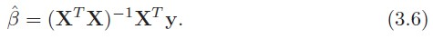

# 3. Linear Method for Regression

## caution

except for 3.7. ~ the end

## 3.1. Introduction

Linear Method는 과거부터 현재까지 널리 쓰이는 모델이다. 그리고, input이 output에 어떤 영향을 미치는지 설명하는 것이 쉬우며, training case가 적거나 signal-to-noise 비율이 낮거나 sparse data인 경우에는 non-linear 모델보다 성능이 좋다.
마지막으로, input 값들의 단위를 변환시키는데 사용되며 이를 'basis-function method'라고 부른다.

## 3.2. Linear Regression Models and Least Squares

선형모델은 p개의 feature())를 가지는 위의 수식으로 표현할 수 있다.

Xj로 위치할 수 있는 Data source

* quantitative inputs
* transformations of quantitiative inputs, such as log, squared-root or square
* basis expansions, such as , leading to a polynomial representation
* numeric or "dummy" coding of the levels of quantitative inputs
* interactions between variables

Trainin data는 (x1,y1)의 쌍으로 ... (Xn,yn)과 같이 N개의 datapoint로 구성되어 있으며, 하나의 datapoint i에 대해서는 (xi1,xi2,...,xip)와 같이 p개의 column 값으로 구성된다. 그리고 estimation을 통해 추측해야 하는 beta의 값 또한 beta = (b0,b1,...bp)의 와 같이 구성된다.

beta를 estimation 하기 위해 가장 유명한 접근 방법은 RSS 방식이며, 이는 아래와 같다.

training observation (xi,yi)는 모집단으로부터 random(임의로)하게 추출되는 것이 바람직한 방법이다. **그러나 xi가 임의로 추출되지 않더라도 yi가 주어진 xi에 대해 conditionally independent하다면 여전히 RSS 방법은 유효하다.**

====================================

### conditional independent

<a href="http://norman3.github.io/prml/docs/chapter08/2.html">http://norman3.github.io/prml/docs/chapter08/2.html</a>

세 개의 변수 a, b, c가 있다.
* 이 때 b와 c가 주어졌을 때 a에 대한 조건부확률을 계산해보자.
* a가 b에 독립적이라면 다음과 같은 식이 성립한다.
    
    

    위의 경우를 c가 주어졌을 때 a는 b에 대해 조건부 독립이라고 표현한다.

* 이런 상황에서 c가 주어진 상태의 a와 b의 결합 분포는 다음과 같다.

    

    이를 조건부 독립이라고 하고, 다음과 같이 표기한다.

    

확률 변수의 조건부 독립여부는 중요한 속성이다.
* 사용되는 모델을 단순화시킬 수 있고,
* 학습에 필요한 연상량을 낮출 수 있다.

====================================

eq 3.2.는 linear model 3.1.에서 아무런 가정이 없는 수식이지만 Least square 방식으로 어느 정도는 fitting 가능하다.

X를 N X (p+1) matrix로, y를 N vector로 구성된 훈련셋의 output으로 따져볼 때, 어떻게 3.2. 식을 최소화할 수 있을까?

3.3. 식을 beta에 대한 2차원식으로 나타내면, RSS를 최소로하는 beta를 계산하기 위해 beta에 대한 1차 및 2차 편미분을 식으로 나타내면 3.4.와 같다.

**X를 full column rank로 가정**하면 는 양의 값을 가지고 1차 미분에 대해 0으로 하는 식은 아래와 같다. 

그리고 이를 unique하게 하는 beta의 값은 위와 같다.

input vector x0에 대한 예측값은 =(1:x_0)^T\hat{\beta})로 나타낼 수 있으며 training input으로 feat된 값은 위의 수식과 같다.

^{-1}X^Ty)는 y에 hat을 붙이기 위한 Matrix로 "hat" matrix라고도 불린다.

위의 그림은 least square 추정을 기하학적으로 나타내었을 때의 그림이며, x0는 1로 가정한 상태에서 x1과 x2 그리고 y에 대한 3차원 공간으로 투영했다. x1과 x2의 부분공간에 y의 직선이 추정치 y hat과 직교하도록 RSS를 최소화하는 beta를 찾아야 한다.

====================================

### rank and dimension in Linear algebra

<a href="https://losskatsu.github.io/linear-algebra/rank-dim/#">https://losskatsu.github.io/linear-algebra/rank-dim/#</a>

X의 컬럼들이 선형 독립이 아닌 경우(bot of full rank)가 발생할 수 있다(i.e. x2 = 3x1). 이 경우에는 는 singular(역행렬을 가지지 않음)이며, least square의 beta hat은 unique한 값을 가질 수 없게 된다. 그러나 y hat은 여전히 X column들의 부분공간에 투영된다; X의 컬럼 벡터들의 관점에서 투영되는 것을 다른 방법으로 설명할 수 있다.

====================================

이러한 non-full rank case(컬럼간에 독립이 아닌 경우)는 qualitative input이 중복적으로 반영될 때 나타나며, 이를 위한 일반적인 방법은 반영을 새로하거나 X의 중복 컬럼을 제거하는 것이다. 

그리고 Rank Deficiency(training sample의 수보다 컬럼의 수가 더 많은 경우)의 경우에는 feature를 filtering이나 정규화를 반영한 fitting을 통해 해결한다.

**벡터 X의 컬럼이 상호 독립적이라는 가정을 가지고, beta hat을 추정하는데 yi간에 상관관계가 없고 의 분산을 가지고 xi가 고정(non random)되어 있다고 가정하자.** Least sqaure 파라미터 추정을 위한 분산-공분산 matrix는 3.6과 아래의 3.8 수식을 통해 도출된다.

====================================

### 분산-공분산행렬 [variance-covariance matrix]

<a href="https://adioshun.gitbooks.io/statics-with-r/content/variance-covariance-matrix.html">https://adioshun.gitbooks.io/statics-with-r/content/variance-covariance-matrix.html</a>

k feature에 대한 정방행렬(k X k 행렬)을 각 변수의 분산과 공분산으로 채운 것.
* 대각행렬: 각 변수의 분산
* 이외의 값: 변수 사이의 공분산

====================================

3.6.과 3.8.을 가지고 yi에 대한 분산은 아래와 같이 나타낼 수 있다.

분모로 N 대신에 N-p-1를 하는 이유는 yi의 분산 추정량 sigma-hat-sqaure를 sigma-square의 불편추정량으로 만들기 위함이다(=\sigma^2)). 

====================================

### 불편추정량

<a href="http://www.aistudy.co.kr/math/estimate_lee.htm">http://www.aistudy.co.kr/math/estimate_lee.htm</a>

불편추정량은 편의가 없는 추정량이며, 이는 추정량이 모수에 대하여 큰 차이를 보이지 않고 어느 한쪽으로 치우침이 없다는 의미. 그러므로 불편추정량은 모수에 대하여 올바른 추정량이라는 의미이다.

i.e. 표본평균 및 표본비율에 대해서는 표본에 대한 기대값이 모수의 추정량과 같으므로 불편추정량이다.

====================================

표본분산은 편차의 제곱합을 N-1로 나누는데, 이는 표본분산이 모분산을 추정함에 있어 불편추정량이 되기 위해서이다. 이렇게 나눔으로써 표본분산의 기대치가 모분산과 같아진다.

파라미터(beta)와 모델에 대해 추정을 위해서 추가적인 가정이 또 필요하다. 이는 수식 3.1.에 대해서, **X의 기대값에 gaussian 분포를 따르는  error, Gaussian random variable; epsilon(}))을 더하는 것**이다.

3.9를 바탕으로 beta hat을 아래와 같은 정규분포로 정의할 수 있다.

3.10은 mean vector와 분산-공분산행렬으로 표현할 수 있는 다항 정규 분포이며, yi와 yi-hat의 오차합인 (N-p-1)sigma-square는 sigma-square X N-p-1의 카이제곱 분포를 따르는 값이 된다.

이러한 분포적인 특징을 가지고 파라미터 beta-j를 위한 가설 및 신뢰구간을 검증하는데 사용한다.

### 카이제곱분포

<a href="https://math100.tistory.com/44">https://math100.tistory.com/44</a>

====================== p.49(before examples)