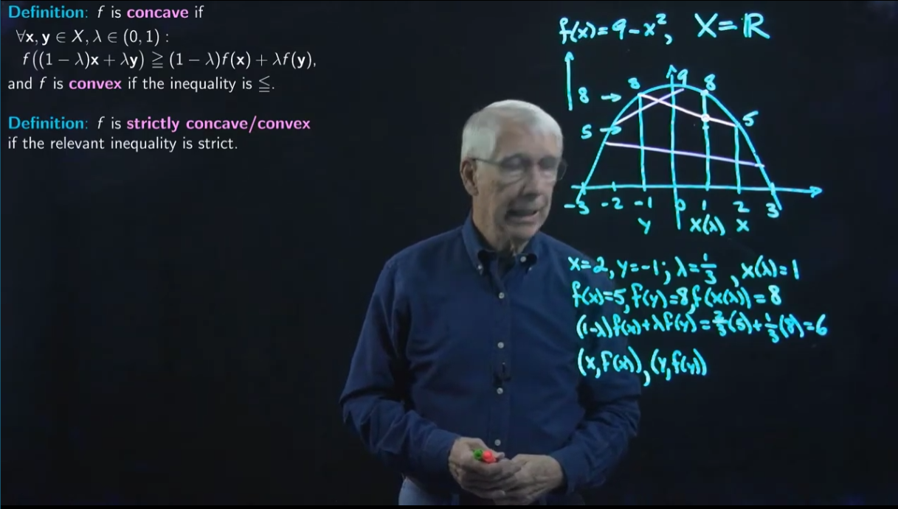
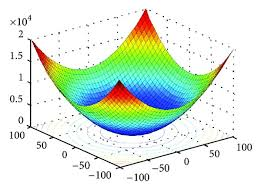
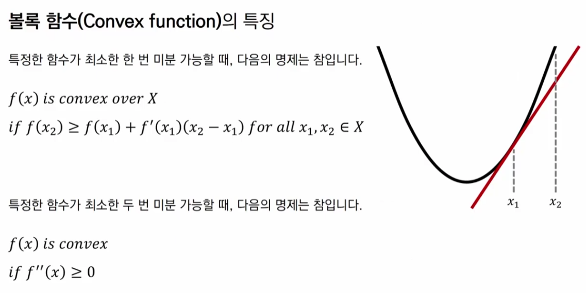

# 4-1. Concave and Convex function.

## Reference 

<a href="https://www.youtube.com/watch?v=s0dZVmPN3Ww">Lecture 17(A): Concave and Convex Functions</a>

<a href="https://www.youtube.com/watch?v=nlT-FuOaeJc">볼록 함수(Convex Function) | 인공지능 및 컴퓨터 비전을 위한 수학 핵심 개념 노트(Mathematics for AI)</a>

## Concave/Convex function

오목함수를 다루기 전에, 정의해야 할 것들을 먼저 알아보자.

임의의 정의역 X가 있고 이는 1차원 vector 평면에 펼쳐져있다고 가정하자.

* 이때, X를 Concave set로 하고
* 임의의 함수 $f:X\rightarrow{R}$ 가 존재한다.

위를 가정하고, 오목 함수와 관련된 정의는 아래와 같다.

Definition

function f는 concave하다고 말할 수 있다. 

만약,
* $\forall{x,y}\in{X}, \lambda\in(0,1)$인 변수로,

* $f((1-\lambda)+\lambda{y})\geq(1-\lambda)f(x)+\lambda{f(y)}$를 만족한다면 

function f를 concave하다고 할 수 있다.

그런데, 부등호가 반대를 향한다면 convex function이라고 한다.

이를 좀 더 부분적으로 알아보기 위해

concave combination: $x(\lambda)=(1-\lambda)x+\lambda{y}$

위와 같이 나누어 정의하고, 아래와 같이 나타낼 수 있다. 

$f(x(\lambda))\geq(1-\lambda)f(x)+\lambda{f(y)}$

예시를 통해 concave function를 살펴보자

예를들어 위의 그림과 같이 대상 함수와 X를 설정하자.

$f(x)=9-x^2,\ X=R$

위의 함수를 그림으로 나타내면 이와 같은 2차 함수가 되고, X에서 임의의 실수를 x,y로 뽑고 scaler 역할을 하는 lambda 값을 0과 1사이에서 뽑는다.

그렇다면, 각각에 대해서 계산하면,

* $X=2,y=-1;\lambda=\frac{1}{3},x(\lambda)=(1-\lambda)x+\lambda{y}=\frac{2}{3}*2+\frac{1}{3}*(-1)=1$
* $f(x)=5,f(y)=8,f(x(\lambda))=8$
* $(1-\lambda)f(x)+\lambda{f(y)}=6$

각각의 항목에 대해서 계산한 값을 가지고 concave function의 정의에 대입해보자. 

임의로 추출한 x와 y의 결과값은 5와 8이고, concave combination한 좌표의 결과값은 8이다. 그런데, 각 좌표 결과값에서 lambda를 취한 결과 값은 6이다.

이를 좌표상에서 나타내면 5와 8의 점을 선으로 그었을 때, concave combination 좌표에서 얻는 y값이다.

이를 $x(\lambda)$와 비교하면 $8\geq{6}$이기 때문에 concave하다고 할 수 있다. 그리고, 좌표상의 그래프와 선으로 살펴보았을때, 각 좌표를 이어 만든 직선은 목표 function보다 아래에 있음을 알 수 있다.

따라서, function이 concave하다는 것은 모든 두 지점 x,y와 모든 scaler $\lambda$에 대해서 지점을 이은 직선은 목표 function보다 안에 있어야 할 것이다. 

### strictly concave/convex function

기존 concave function definition의 부등호에서 등호가 성립하지 않는 경우를 'strict'한 케이스라고 할 수 있다.

### concave to convex

만약, function이 concave한 경우 이의 음의 함수는 convex하다고 할 수 있다. 따라서 convex함수는 concave함수와 달리 최적의 minimize하는 지점을 지닌 함수라고 할 수 있다. 

### Linear Function with concave/convex function

선형 함수는 concave function의 정의에 따라 등호에 해당되기 때문에 convex function도 될 수 있다. 

## Expansion to 2 dimensional X

만약 위의 예제와 달리 x가 좌표로 계산된다면 어떻게 될까?

$x = (x1,x2), y=(y1,y2)$

그렇다면 각 x와 y에 대한 결과값을 표현하기 위해 한 차원을 더 필요로 하여, 3차원의 형태로 목표 function이 나타날 것이고 이는 아래와 같이 나타날 것이다.

## Why Convex function is needed at ML/DL Problem?

만약 우리의 손실 함수가 convex function임을 찾아내고 증명한다면, 이의 최적의 점을 찾는 계산과정이 용이해지기 때문이다. 

## Taylor Expansion with convex function

임의의 지점에서 근사하는 값을 구하기 위한 테일러 전개식은 1차 도함수 까지 전개했을 때는 아래와 같다.

$f(x)=f(a)+f'(a)(x-a)$

이를 convex function에 대입하면, 아래의 특징을 얻을 수 있다.

