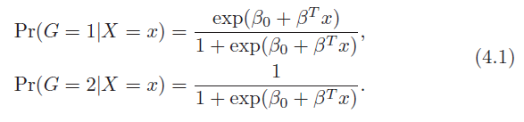
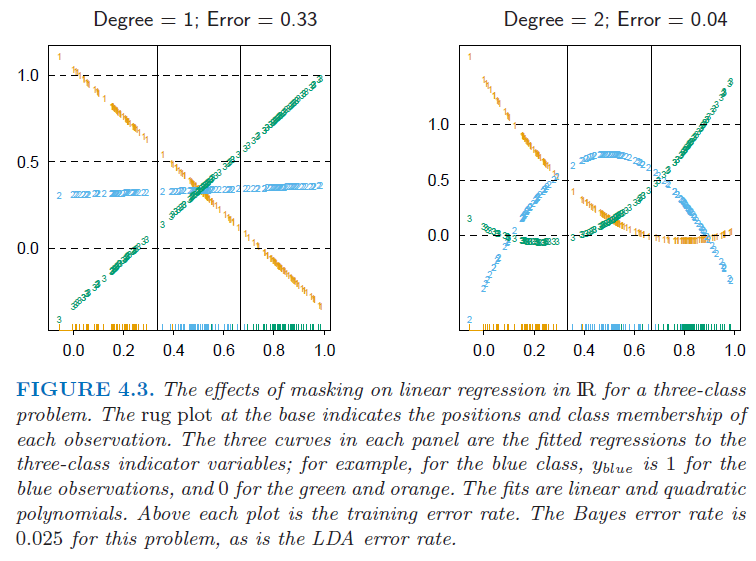
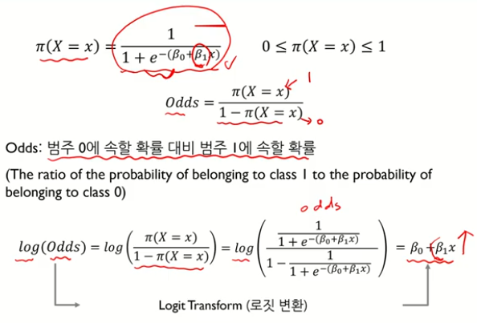
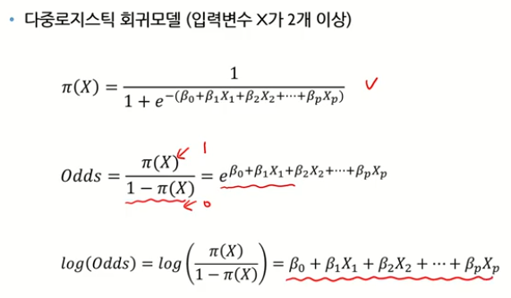
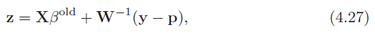
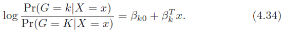

# Linear Methods for Classification

## 4.1. Introduction

해당 절에서는 linear method를 분류문제에 적용한 기법들에 대해서 알아보려고 한다. 해당 절에서 예측해야하는 변수 $G(x)$는 이산적인 $g$개의 변수를 가지고, input space를 classification에 따라 타겟 변수의 값별로 나눠보려고 한다.

분류해야하는 타겟 값에는 K개의 class가 있으며, k번째 타겟을 위한 선형 모델의 값은 $\hat{f}_k(x)=\hat{\beta}_{k0}+\hat{\beta}^T_{k}x$이다. class k와 l의 결정 경계는 $\hat{f}_k(x)=\hat{f}_l(x)$가 같아지는 지점들의 집합이고, 이는 $\{x:(\hat{\beta}_{k0}-\hat{\beta}_{l0})+(\hat{\beta}_{k}-\hat{\beta}_{l})^Tx=0\}$와 같이 나타낼 수 있다. 이로 인해, input space는 classification 된 공간으로 나눠질 수 있는 것이다. 

이러한 회귀적인 접근법은 각 클래스를 위해 모델된 discriminant functions $\delta_k(x)$로 각 discriminant function의 최대값을 가지고 x를 각 클래스로 분류한다. 사후 확률 $Pr(G=k|X=x)$로 모델링하는 모델 또한 위의 접근법에 속한다. $\delta_k(x)$ 또는 $Pr(G=k|X=x)$가 x에 대해 선형적이라면, 결정 경계 또한 선형이 될 것이다. 

따라서, 결정경계를 선형으로 하기 위해서는 $\delta_k(x)$ 또는 $Pr(G=k|X=x)$이 선형이 되도록 단조변환을 거쳐야 할 것이다. 

이를 여러 변환 방법 중 $log[p/(1-p)]$(Logit Transform)에 대해 단조변환하게 되면, x에 대한 Linear equation으로 정리할 수 있다. 

위의 식에서 결정경계는 4.2.의 우변의 수식을 0로 하는 값을 찾는 것이며, 이를 초평면에는 $\{x|\beta_0+\beta^Tx\}$로 정의한다. 이를 계산하는 방식에는 아래의 방법이 있다. 

* Linear Dicriminant Analysis
* Linear Logistic Regression

이 둘의 가장 중요한 차이는 훈련데이터셋에 linear function을 학습하는 방법이다. 

## 4.2. Linear Regression of and Indicator Matrix

결과 값으로 나온는 class들을 'indicator variable'이라고 하자. 만약 $g$가 K개의 클래스를 갖는다면, $k=1,...,K; Y_k$의 indicator가 있고 만약 특정 Row의 target G=k이면 1 아닌 경우에는 0의 값을 가진다. 이를 벡터 Y로 하여 $(Y_1,...,Y_K)$로 나타내면, Y는 N개의 train data를 가지는 경우에 0과 1로 구성된 NXK 행렬로 나타난다. 

분류 문제를 linear regression 방식으로 나타내면 수식 4.3.과 같아진다. Y가 K개수의 class만큼 늘었기 때문에, 추정해야하는 coefficieint Beta의 값 또한 (p+1) X K 행렬로 나타난다. 

즉, 각각의 Class에 대해 Linear Regression을 수행하는 것이다.

* 4.3.의 식으로 추정한 estimator에 따른 수식은 $\hat{f}(X)^T = (1,x^T)\hat{B}$
* 각 row 별로 k 클래스의 $\hat{f}(X)^T$ 중에 가장 큰 값을 예측값이라고 하면, 예측한 결과값을 아래와 같이 나타낼 수 있다. 

    $\hat{G}(x)=argmax_{k\in{g}}\hat{f}_k(x)$ (4.4)

조건부 기대값을 추정하는 회귀방법으로 문제를 바라본다면, 랜덤변수 $Y_k$에 대해 $E(Y_k|X=x) = Pr(G=k|X=x)$이며, 이 또한 적절한 목표가 될 수 있다. 이 방식의 논점은 rigid linear regression model보다 더 우수한지 질문에 답하는 것이다. 

이는 각 예측치에서 얻는 1값이 무조건 하나인 $\sum_{k\in{g}}\hat{f}_k(x)=1$로 인해 쉽게 검증할 수 있다. 그러나 결과값이 음수이거나 1개 이상의 1이 있다면 다른 우수한 방법이 있을 것이다.

만약 인풋의 기저의 확장인 h(X)위에 선형 회귀를 할 수 있다면, 확률의 추정치들을 지속적으로 이끌어 낼 수 있다. 훈련 데이터의 개수 N이 늘어날수록, 이러한 기저함수위에 선형회귀가 조건부 평균에 접근할 수 있도록 더 많은 기저 항목들을 포함해야 한다. 

간단한 방법으로, 각 클래스에 대해 K X K target 단위행렬을 생성하고 이에서 k번째 컬럼값인 tk를 활용하는 것이다. prediction의 목표는 관측치에서 적절한 target의 추정치를 만들어 내는 것이다. 이는 $g_i=k$이면 $y_i=t_k$가 된다. 

* fit the linear model by least square

    

    
    

    **B** is coefficient vector for class_K in column-wise.

fit된 vector로 새 관측값을 분류하게 되면,

이는, 회귀의 ridge 방식에서 사용하는 squared norm 이  다중 분류를 위해 회귀식을 사용하는 선형모델과 같기 때문에 수식 4.5.를 4.6.(regression per column)과 같이 나타낼 수 있다. 

regression approach의 심각한 단점은 예측하고자하는 클래스 값이 3개 이상인 경우이다. 회귀 모델의 엄격성으로 인해 클래스는 상호간에 겹쳐질 수 있다(Masking problem). 

각각의 3클래스의 데이터를 x축에 투영하면 각각 3개의 중심점을 가진다. 각각의 클래스들의 respond를 Y1,Y2,Y3로 나타낸다. 좌측 이미지의 2번째 클래스의 선은 수평이고 fitted value는 never dominant이다. 그래서 class 2값은 1 또는 3의 값으로 매핑될 것이다. 우측 이미지는 2차식의 회귀선이다. 이는 선형 회귀선과 다르게 문제를 해결할 수 있다. 만약 우측 이미지에서 4개의 클래스로 변화하는 경우 optimal한 경우를 찾기 위해서는 3차식의 변형 또한 고려해야 할 것이다. 

그래서 class의 수 K가 3이상이라면 K-1 수준의 polynomial feature를 생성해야 이를 해결할 수 있을 것이다. 

이를 p차원의 input 값, K개의 class로 일반화하게 되면, K-1, $O(p^{K-1})$의 수준과 복잡도를 해당 문제를 해결하는데 소요된다. 

**Why Linear Regression could not classify over two classes?**

이는 linear regression 방식은 Target / The other 방식으로 대상을 분류하기 때문이다. LDA는 두 클래스 샘플간의 결정경계를 구하여 모든 클래스들을 구분할 수 있다. 

### 4.3. Linear Discriminant Analysis

#### References

<a href="https://ratsgo.github.io/machine%20learning/2017/03/21/LDA/">https://ratsgo.github.io/machine%20learning/2017/03/21/LDA/</a>

<a href="https://www.youtube.com/watch?v=geIlsP8aPvg">https://www.youtube.com/watch?v=geIlsP8aPvg</a>

<a href="https://godongyoung.github.io/%EB%A8%B8%EC%8B%A0%EB%9F%AC%EB%8B%9D/2018/01/23/ISL-Classification_ch4.html">https://godongyoung.github.io/%EB%A8%B8%EC%8B%A0%EB%9F%AC%EB%8B%9D/2018/01/23/ISL-Classification_ch4.html</a>

<a href="https://blueskyvision.tistory.com/351">https://blueskyvision.tistory.com/351</a>

판별분석(Discriminant Analysis): 두 개 이상의 모집단에서 추출된 표본들이 지니고 있는 정보(표본들이 Gaussian Distribution을 따른 다던지...)를 이용하여 이 표본들이 어느 모집단에서 추출된 것인지를 결정해 줄 수 있는 기준을 찾는 분석법

특정 축으로 샘플들을 투영했을 때, Class들을 잘 분류할 수 있는가?

* 판별 변수(X): 독립 변수 중 판별력이 높은 변수. 이를 선택하는데 있어, '판별기여도 + 다른 독립변수와의 상관관계'를 고려해야 한다. if 독립변수간의 상관관계가 높은경우, 하나를 선택하고 이와 상관관계가 적은 독립변수를 선택하여 효과적인 판별 함수를 설계.

* 판별 함수: 판별 함수를 통해 각 개체들이 소속집단에 얼마나 잘 판별되는가에 대한 **판별력**(판별점수)을 측정하고 새로운 대상을 어느집단으로 분류할 것이냐를 예측하는데 주요 목적이 있다. 

**판별 점수의 집단간 변동과 집단내 변동의 배율을 최대화하는 판별함수를 도출해야 한다.**

* 표본의 크기
    * 전체 표본의 크기는 독립변수의 개수보다 3배(최소 2배)이상 되어야 한다.
    * 종속 변수의 집단 각각의 표본의 크기 중 최소 크기가 독립변수의 개수보다 커야한다. (판별력을 좌우하는 것은 가장 적은 집단의 표본수이기 때문이다.)

LDA(Linear Discriminant Analysis)

* 가정
    * 각 클래스 집단은 정규분포 형태의 확률분포를 가짐
    * 각 클래스 집단은 비슷한 형태의 공분산 구조를 가진다.

** 공분산 행렬이 2개의 분포에 대해 이와 같이 나타난다면, 
$\sum=\begin{bmatrix}\sigma^2\ 0 \\0\ \sigma^2\end{bmatrix}$ 각 대각행렬의 값은 타원이 어떤 형태를 띄는지 결정하고 나머지 0의 element는 어떻게 회전시킬지를 결정한다. 

LDA를 적용할 수 있는 사례

* LDA&QDA의 기능(즉, DA의 기능)

    

    
LDA와 차원 축소

    
    

    \- 판별과 차원 축소의 기능을 가진다. 2-dimensional(X=x1,x2) problem에 분류를 수행하면 차원을 축소하는 기능과 유사하다. 왜냐하면 LDA를 수행함에 있어 하나의 축에 사영함으로써 각 클래스를 구분하기 때문이다. 따라서, 데이터가 각 축에 사영하면서 x1과 x2데이터는 하나의 차원으로 표현이 된다. 즉 판별력도 높이고 차원 축소의 기능도 나타낸다. 

* 결정경계의 특징

    * projection 축에 직교하는 축
    * 정 사영은 두 분포의 특징이 아래의 목표를 달성해야 한다.
        * 각 클래스 집단의 평균의 차이가 큰 지점을 결정 경계로 지정 (각 샘플의 분포의 평균의 차이)
        * 각 클래스 잡단의 분산이 작은 지점을 결정 경계로 지정 (결정 경계를 기준으로 타원의 퍼진 정도)
        * 즉, 분산 대비 평균의 차이를 극대화하는 결정 경계를 찾고자 하는것. ($\frac{diff\ of\ mean}{variance}$)

* 문제점

    \- 공분산 구조가 많이 다른 경우는 반영할 수 없다. 이를 위해 QDA(이차판별분석법)를 사용하여 해결

* QDA

    

    
Dicision Boundary: LDA with Data augmentation / QDA

    
    

    \- 공통 공분산 구조 제약을 충족할 수 없는 경우 사용한다. if 선형 결정 경계의 경우에는 이를 올바르게 구분할 수 없다. 그러나 LDA는 변수의 제곱을 추가적인 변수로 사용하여 보완할 수 있다. 

    그러나 QDA는 서로 다른 공분산 데이터를 분류하기 위해 샘플을 많이 필요로 한다. 그런데, 설명변수의 개수가 많을 경우 추정해야하는 모수(coefficients named beta)가 많아져서 연산량이 크다. 

최적의 분류를 위해서는 클래스별 사후확률인 $Pr(G|X)$를 알 필요가 있음을 이전에 알아봤었다. 

$Pr(G|X)$을 계산하기 위해서는 아래의 두 element들이 필요하고

* $f_k(x)$: G가 k인 경우에 X의 class-conditional density
* $\pi_k$: 클래스 k의 사전확률 

이를 통해 수식 4.7을 도출할 수 있다. 

$$
\begin{aligned}
Pr(A|B) &= \frac{Pr(A\cap{B})}{Pr(B)} \\
Pr(B\cap{A}) &= Pr(B|A)*Pr(A) \\
\\
Pr(G=k|X=x) &= \frac{Pr(G=k)\cap{Pr(X=x)}}{Pr(X=x)} \\
&= \frac{Pr(X=x)\cap{Pr(G=k)}}{\underset{l=1}{\overset{k}{\sum}}f_l(x)*\pi_l} \\
&= \frac{f_k(x)\pi_k}{\underset{l=1}{\overset{k}{\sum}}f_l(x)*\pi_l}
\end{aligned}
$$

이를 구하기 위해서는 $f_k(x)$를 알아내야만 하고, 이를 찾는것이 $Pr(G=k|X=x)$를 찾는것과 동일하다고 할 수 있다. 

그렇다면, 각각의 class들의 분포가 다변량정규분포(multivariate Gaussian[Normal Distribution])를 따른다고 가정하자.

다변량 정규분포는 1차원 정규분포를 다차원으로 확장한 것을 말한다. 

그리고, LDA는 각각의 클래스들의 샘플이 공통적인 공분산 matrix $\sum_k=\sum\forall{k}$를 가정하는 상황에서 활용된다.

$$
\begin{aligned}
&=(log\pi_k+x^T\sum^{-1}\mu_k-\frac{1}{2}\mu_k^T\sum^{-1}\mu_k)-(log\pi_l+x^T\sum^{-1}\mu_l-\frac{1}{2}\mu_l^T\sum^{-1}\mu_l) \\
&= \delta_k(x)-\delta_l(x)
\end{aligned}
$$

#### Derive Equation 4.9

$$
\begin{aligned}
\frac{Pr(G=k|X=x)}{Pr(G=l|X=x)} &= \frac{\frac{Pr(X=x|G=k)*Pr(G=k)}{Pr(X=x)}}{\frac{Pr(X=x|G=l)*Pr(G=l)}{pr(X=x)}} \\
&= \frac{Pr(X=x|G=k)*Pr(G=k)}{Pr(X=x|G=l)*Pr(G=l)} \\

log\frac{Pr(G=k|X=x)}{Pr(G=l|X=x)} &= log \frac{Pr(X=x|G=k)*Pr(G=k)}{Pr(X=x|G=l)*Pr(G=l)} \\
&= log\frac{Pr(X=x|G=k)}{Pr(X=x|G=l)}+log\frac{Pr(G=k)}{Pr(G=l)} \\
&= log\frac{f_k(x)}{f_l(x)}+log\frac{\pi_k}{\pi_l} \\
&= -\frac{1}{2}[\{plog2\pi+log|\Sigma_k|+(x-\mu_k)^T\Sigma_k^{-1}(x-\mu_k)\}-\{plog2\pi+log|\Sigma_l|+(x-\mu_l)^T\Sigma_l^{-1}(x-\mu_l)\}]+log\frac{\pi_k}{\pi_l}\\
&(\because{f_K(x))=\frac{1}{(2\pi)^{p/2}|\Sigma_K|^{1/2}}e^{-\frac{1}{2}(x-\mu_K)^T\Sigma_K^{-1}(x-\mu_K)}}) \\
&=-\frac{1}{2}[(x-\mu_k)^T\Sigma_k^{-1}(x-\mu_k)-\{(x-\mu_l)^T\Sigma_l^{-1}(x-\mu_l)\}] -\frac{1}{2}(log|\Sigma_k|-log|\Sigma_l|)+log\frac{\pi_k}{\pi_l} \\
&=-\frac{1}{2}(\mu_k+\mu_l)^T\Sigma^{-1}(\mu_k-\mu_l)+x^T\Sigma^{-1}(\mu_k-\mu_l)+log\frac{\pi_k}{\pi_l} \\
&(\because{Class\ k\ and\ l\ has\ same\ Covariance;\ Pooled\ Variance}) \\
&(\Sigma_k=\Sigma_l=\Sigma=[\frac{n_1-1}{(n_1-1)+(n_2-1)}]\Sigma_1+[\frac{n_2-1}{(n_1-1)+(n_2-1)}]\Sigma_2) \\
\therefore{log\frac{Pr(G=k|X=x)}{Pr(G=l|X=x)}}&=log\frac{\pi_k}{\pi_l}-\frac{1}{2}(\mu_k+\mu_l)^T\Sigma^{-1}(\mu_k-\mu_l)+x^T\Sigma^{-1}(\mu_k-\mu_l)

\end{aligned}
$$

임의의 2개의 클래스를 비교하기 위한 수식은 x에 대해 선형적인 방정식으로 나타난다. 이는 k와 l의 결정경계가 p-dimensional한 초평면위에 x에 대해 선형적인 형태로 나타남을 의미한다. 만약 input dataset을 class 1, class 2 등등에 대해 분류하더라도 임의의 초평면에 의해 분리될 것이다. 

위의 예시는 3개의 클래스가 각각이 정규분포를 따르고 동일한 공분산형태를 가지는 경우 결정경계를 선형으로 하여 문제를 해결하는 것을 나타낸 것이다. 

실제로는 정규분포의 파라미터를 모르기 때문에 훈련데이터로부터 아래의 세가지를 추정해야 한다.

두개의 class를 위해 linear regression으로 결정경계를 결정하는 방법론은 eq 4.5.이고, LDA 방식으로 결정하는 방식은 아래와 같다.

least sqaure방식을 통한 LDA direction을 도출하는 것은 Gaussian 가정을 하지 않기 때문에 Gaussian 하지 않는 일반적인 데이터에도 활용될 수 있다.

만약 LDA에서 2개의 클래스 이상을 분류해야 한다면 더이상 class indicator matrix의 linear regression한 방식과 동일하지 않으며, LDA는 위에서 나타난 masking problem에 대처할 수 있게 된다.

만약 분류하는데 있어서 class들의 공분산 matrix가 동일하지 않는다면 식 4.9의 편리하게 도출된 식은 사용할 수 없다. 우리는 이를 위해 QDA(quadratic discriminant function)을 사용해야 한다. 

class k와 l간의 결정경계는 2차 방정식인 $\{x:\delta_k(x)=\delta_l(x)\}$로 나타낼 수 있다. 

위의 그림은 결정경계가 2차방정식 즉 곡선의 형태를 나타낸다고 가정했을 때, 접근하는 두 가지 방법론을 나타낸다. 좌측은 feature를 2차식의 형태로 polynomial feature를 만들어 반영(LDA의 기본 가정인 클래스의 분산은 모두 합동분산(Pooled Variance)을 따름)하였고, 우측은 QDA를 적용했을 때의 결정경계를 나타낸다. 

QDA의 추정치는 LDA와 각각의 클래스들에 대한 공분산행렬이 다르다는 것만들 제외하면 유사하다. 그러나 차원(컬럼)의 수 p가 늘어나게 되면 추정해야하는 파라미터 또한 엄청나게 증가하게 된다. 

* LDA: (K-1) X (p+1) parameters

    $\delta_k(x)=x^T\Sigma^{-1}\mu_k-\frac{1}{2}\mu_k^T\Sigma^{-1}\mu_k+log\pi_k$,

    LDA는 결국 기준이 되는 클래스 K와 나머지 클래스 k,l,...간의 비교로 결정경계를 결정하기 때문에 (K-1)번의 파라미터 계산이 필요하다. 그리고 한번의 파라미터 계산에는,

    $$
    \begin{aligned}
    \delta_k(x)-\delta_K(x)&=x^T\Sigma^{-1}\mu_k-\frac{1}{2}\mu_k^T\Sigma^{-1}\mu_k+log\pi_k - \{x^T\Sigma^{-1}\mu_K-\frac{1}{2}\mu_K^T\Sigma^{-1}\mu_K+log\pi_K\} \\
    &= x^T\Sigma^{-1}(\mu_k-\mu_K)-\frac{1}{2}(\mu_k+\mu_K)\Sigma^{-1}(\mu_k-\mu_K)+log\frac{\pi_k}{\pi_K} \\
    &= x^T\Sigma^{-1}(\mu_k-\mu_K)\rightarrow{p\ parameters}, remainder\rightarrow{1} \\
    &= p+1\ parameters
    \end{aligned}
    $$

* QDA: (K-1) X {p(p+3)/2+1} parameters

LDA와 QDA가 좋은 결과를 내는 이유는 결정경계를 선형 또는 2차식의 곡선임을 가정할 뿐만 아니라, 각각의 추정해야하는 class들의 분포가 정규분포를 따른다고 가정하기 때문이다. 

### 4.3.1. Regularized Discriminant Analysis

LDA와 QDA를 혼합한 방식을 일컬으며, ridge회귀와 비슷한 형태를 띈다. alpha는 LDA와 QDA의 정도를 조절하는 파라미터이다. 

### 4.3.2. Computation for LDA

LDA와 QDA의 계산은 대부분 공분산 행렬을 다른 형태로 간단히함으로써 나타난다. $\hat{\sum}_k=U_kD_kU_k^T$로써 공분산 행렬을 간단히할 수 있고 Uk는 pxp의 직교행렬, Dk는 양의 고유값 dkl의 대각행렬이다. 

* why $log|\hat{\Sigma_k}|=\sum_llogd_{kl}$?

    $$
    \begin{aligned}
    \hat{\Sigma}_k &= U_kD_kU_k^T \\
    |\hat{\Sigma}_k| &= |U_k||D_kU_k^T| \\
    &= |D_kU_k^T||U_k| \\
    &= |D_k|I \\
    &= \prod^ld_{kl} \\
    log|\hat{\Sigma}_k| &= \sum^l logd_{kl}
    \end{aligned}
    $$

* Idea of LDA.

    두 클래스에 대한 $\delta$를 구분하는데 있어 중요한 항목은 수식 4.12에서 가운데 해당하는 부분이다.

    $\delta_k(x)=-\frac{1}{2}log|\Sigma_k|-\frac{1}{2}(x-\mu_k)^T\Sigma_k^{-1}(x-\mu_k)+log\pi_k$

    $-\frac{1}{2}(x-\mu_k)^T\Sigma_k^{-1}(x-\mu_k)$

    위의 수식에서 공분산 Sigma를 제외하면, 새로운 datapoint x에 대해 k클래스의 중심점으로부터의 Euclidean Distance를 나타낸다. Sigma를 1/2씩 분리하여($(x-\hat{\mu}_k)^T\hat{\Sigma}^{-\frac{1}{2}}$,$\hat{\Sigma}^{-\frac{1}{2}}(x-\hat{\mu}_k)^T$) 각각에 분배하면, 클래스의 분산을 Sphere(원형으로; Identical Shape)하게 Transform한 공간에서의 distance를 의미한다. 

위의 간단화한 수식을 활용하여 LDA를 계산하는 방식은 아래의 절차를 따른다. 

* 데이터가 공통적인 공분산을 따르도록 공분산 행렬을 $\hat{\sum}:X^*\leftarrow{D^{-\frac{1}{2}}U^TX}$ 고유값분해로 얻은 행렬들의 조합 Sigma($U_kD_kU_k^T$)를 활용하여 변환한다. 이를 통해 새로운 추정치는 Identical Matrix를 가진다.   
* 변환된 공간에서 datapoint x를 중심점에 가장 가까운 클래스로 분류한다. 그리고 prior probability로 distance외의 요인을 구분하는데 사용한다.

### 4.3.3. Reduced-Rank Linear Discriminant Analysis

LDA가 유명한 이유는 데이터를 저차원에 정보 손실 없이 projection(how? like PCA)함으로써 나타낼 수 있기 때문이다. 이러한 저차원에 투영된 데이터의 중심점의 분산의 개념을 활용하여 최적의 경계를 찾는법을 Fisher는 찾아냈다. 

LDA의 optimal subspace의 순서를 찾기위한 순서는 아래와 같다. 

* 1-1. Kxp 행렬의 class 중앙점 Matrix X, 그리고 공통 공분산 행렬 W(클래스 내 분산; $\hat{\Sigma}^{-1}$)를 계산

* 1-2. W의 eigen-decomposition을 활용한 $M^*=MW^{-\frac{1}{2}}$ 계산 (Space Transformation)

* 2\. between-class covariance $B^*$를 $B^*=V^*D_BV^{*^T}$와 같이 계산한다.  $V^*$의 컬럼 $v^*_l$(principal component)은 처으부터 끝까지 최적의 coordinate가 순서대로 정렬되어 있다. 

Fisher의 방식은 샘플들이 가우시안 분포를 따라야 한다는 가정을 취하지 않았고 아래와 같이 문제를 정의했다.

'클래스간 분산이 클래스 내 분산보다 **상대적으로 최대화할 수 있는(Dimension Reduction)** 선형조합인 $Z=a^TX$를 찾아야 한다.'

클래스 간의 분산은 Z의 클래스 평균들의 분산을 의미하고, 클래스 내 분산은 평균에 대해 버친 분산을 의미한다. 이는 위의 그림으로 나타난다. 비록 두 접하는 클래스의 중심점이 멀수록 좋지만, 분산의 특성상 유의미한 접하는 영역이 있게 된다. 분산을 위와 같이 조정함으로써 겹치는 영역을 최소화하는 방향을 찾을 수 있다. 

* between-class variance of Z: $a^TBa$ 
* within-class variance of Z: $a^TWa$

수식 4.15를 활용하여 최적의 a1를 계산하기 위해서 v1을 활용하고, a2는 그전의 정보를 활용하여 at까지의 direction을 구한다. al은 'discriminant coordinate'(canonical variate)라고 한다. 

* 공통의 공분산을 가진 가우시안 분류 문제는 linear decision boundary문제로 풀어낼 수 있다. 이는 데이터를 W의 공분산을 가지도록 나타낸다음에 가까운 중심점으로 분류를 수행한다.

* 중심점까지의 상대적거리만을 계산할 수 있기 때문에 조정된 공간에서 중심점에 의해 데이터를 부분공간에 매핑할 수 있다.

* 부분공간은 중심점 분리에 의해 연속적으로 최적의 부분공간으로 분해한다. 

## 4.4. Logistic Regression

### Reference

<a href="https://www.youtube.com/watch?v=l_8XEj2_9rk&t=3s">[핵심 머신러닝]로지스틱회귀모델 1</a>

<a href="https://www.youtube.com/watch?v=Vh_7QttroGM">[핵심 머신러닝]로지스틱회귀모델 2</a>

<a href="https://lee-jaejoon.github.io/stat-logistic/">Logistic Regression</a>

<a href="https://godongyoung.github.io/%EB%A8%B8%EC%8B%A0%EB%9F%AC%EB%8B%9D/2018/01/23/ISL-Classification_ch4.html">[ISL] 4장 - 분류(로지스틱, LDA, QDA) 이해하기</a>

<a href="https://blog.naver.com/lucifer246/187384712">로지스틱 함수에 로짓변형을 취하는 이유-로지스틱 회귀분석</a>

<a href="https://hyeongminlee.github.io/post/bnn002_mle_map/">Maximum Likelihood Estimation(MLE) & Maximum A Posterior(MAP)</a>

<a href="https://machinelearningmastery.com/logistic-regression-with-maximum-likelihood-estimation/">A Gentle Introduction to Logistic Regression With Maximum Likelihood Estimation</a>

<a href="https://hyeongminlee.github.io/post/bnn001_bayes_rule/">Bayes Rule (베이즈 룰)</a>

필요성: 회귀모델을 활용하여 범주형 반응 변수를 예측하기 위함.

그러나, 연속적인 값이 아닌 범주형 값이기 때문에 다른 방식으로 접근해야 할 것이다. 

그래서 일반적인 회귀식에 error의 평균이 0이라고 가정하면, 
E(Y_i)를 두번째 줄과 같이 나타낼 수 있다. 만약 0과 1만을 구분하는 이진분류라고 했을 때, 각각을 예상하는 확률로 인해 Y_i의 기대값은 y=1일 때의 확률과 동일함을 알 수 있다. 

**Logistic Regression은 어떤 범주가 들어왔을때 출력변수 Y가 I의 값을 가질 확률로 표현할 수 있다.**

나이에 대한 질병유무 데이터를 선형적으로 나타내기 위해, 나이를 구간화하고 구간별 질병의 비율로 나타내면 위와 같은 모양을 가진 함수로 도출할 수 있다. 

sigmoid 함수의 장점은 미분을 하게되면 sigmoid 함수의 곱으로 표현이 가능하다. 이 성질은 Gradient를 활용한 학습방식에 사용되는데 중요한 성질이다. 

$\pi$는 x가 1에 속할 확률이고, 이는 y의 기대값과 같음을 fig 1에서 알아보았다. y값이 이진인 경우에는 나머지 등호와 같이 쉽게 나타낼 수 있다. 그리고 이는 $z=\beta_0+\beta_1x$인 선형 결합의 함수를 sigmoid 함수로 전환한 것과 같다. 

* parameta $\beta_1$에 대한 해석.

선형회귀와 달리 비선형적인 결합으로 이루어져 있어 해석이 직관적이지 못하다. 이를 용이하게 하기 위해 '승산'을 정의한다. 

승산: 성공확률을 p라고 할 때, 실패확률대비 성공확률

$Odd=\frac{p}{1-p}$

승산의 개념을 Logistic Regression에 도입한다면, 

1에 속하지 않을 확률 대비, 1에 속할 확률로 나타나며, 아래와 같이 표현할 수 있다. 

$Odds=\frac{\pi(X=x)}{1-\pi(X=x)}$

odd값에 log를 취하면, 단순한 선형결합의 형태로 변환할 수 있다. 결과적으로 beta를 추정하기 위한 수식이 더 직관적으로 변화했다. 

따라서, 우변 수식에서 beta1은 x가 한단위 증가했을 때 log(odds)의 증가량을 나타낸다. 

Detail Review untill figure 6

LR은 실질적으로 비선형결합으로 표현되지만, 승산의 log를 이용하여 선형 결합과 같은 형태로 나타낼 수 있다. 

* 파라미터 추정($\beta_0,...,\beta_p$)

이진 분류에 대하여 특정 클래스일 확률을 pi로 정의했을 때 그의 반대는 1-pi이고, 이에 대한 확률함수는 $f_i(y_i)$와 같이 나타낼 수 있다. 

확률 함수를 가지고 이를 모두 곱하여 얻어낸 지표를 Likelihood라고 한다. 곱셈은 log를 통해 덧셈으로 표현할 수 있고, 이를 간단히 하면 선형 결합에 대한 y와 선형결합을 지수 승한것 과 같은 형태로 정리할 수 있다. 

Log Likelihood를 활용하여 CrossEntrophy 지표로 활용할 수 있다. CrossEntrophy는 Log Likelihood를 음수화 한 값이며, 이의 목적은 기댓값을 최소화 하는 것이다. 

Log Likelihood의 목표는 입력분포 p(x)와 파라미터를 받아 출력분포 q(x)의 확률을 최대화 하는 것이고,

이와 반대로 CrossEntrophy는 입력분포 p(x)와 출력분포 q(x)의 차이를 최소로 하는 것이다. 

==================================================

Logistic Regression은 K class들의 사후확률을 linear function으로 모델링하기 위해 고안되었다. 
(<=> LDA, LDA는 Sample들의 평균과 분산을 활용하여 decision boundary를 추정함)

model은 식 4.17과 같이 ~~LDA처럼 logit transformation된 형태로 용어들을 정의한다.~~ 분모에 깔리는 비교를 위한 클래스는 임의로 선택되며, 각 클래스별 결과값을 추론하는데 필요한 beta의 값 $\Theta$는 $\{\beta_{10},\beta_1^T,...,\beta_{(K-1)0},\beta^T_{K-1}\}$이고, X가 주어졌을때 k클래스에 속할 확률을 간단히 하여 $p_k(x;\Theta)$라고 하자.

클래스의 수가 2개인 경우 이 모델은 간단한 linear function이 된다.

### 4.4.1. Fitting Logistic Regression Models

Logistic Regression은 linear function을 구하는데 있어 likelihood function을 활용하고 이를 최대화하는 maximum likelihood를 G와 X의 conditional likelihood로 linear function을 fit한다. 

이를 수식으로 나타내면 수식 4.19와 같다.

($p_k(x_i;\Theta)=Pr(G=k|X=x_i;\Theta)$)

우리는 하나의 데이터 포인트에 대해서, 모든 클래스 각각에 속할 확률($p(\Theta|x_i$)을 나타내야 한다. 그래서 이를 위해 likelihood $p_k(\Theta|Data)$ 들로 목표를 계산하여 높은 확률을 띄는 클래스로 분류하는 것이다.

그러나, $\Theta$는 우리가 추정해야할 parameter이기 때문에 Bayes' Rule에 따라 likelihood와 prior를 통해 결과를 추정하게 된다. 그러나 prior는 경험적으로 얻을 수 있는 값이기 때문에 likelihood만을 계산하면 된다. 그리고 확률을 최대화 하기 위해서는 likelihood($p_k(x_i;\Theta)=Pr(G=k|X=x_i;\Theta)$)를 최대화 해야하는 데, 그렇기 때문에 MLE가 최적의 결과값 $p_k(\Theta|Data)$를 계산하는데 목표 및 기준점이 될 수 있다. 

* Posterior: 주어진 대상이 주어졌을 경우, 구하고자하는 대상의 확률분포 $p(\Theta|D)$

* Likelihood: 구하고자하는 대상을 모르지만 안다고 가정했을 경우, 주어진 대상의 분포. $p(D|\Theta)$

* prior: 주어진 대상과는 무관하게 상식을 통해 우리가 구하고자 하는 대상에 대해 이미 알고 있는 사전 정보. $p(\Theta)$

여기서 likelihood로 도출되는 값은 사실 확률이다. 따라서 목표하는 모든 likelihood가 최대로 되는 것을 반영하기 위해서는 각 point i에 대한 확률값을 들이 모두 최대가 되어어야 하고 이를 모두 곱셈으로 반영한 값 또한 최대가 되어야 한다.

따라서 이를 $p(Data|\Theta)$로 나타낼 수 있고, 이는 위의 수식과는 조금 다른 $\overset{N}{\underset{i=1}{\prod}}p_{g_i}(x_i;\Theta)$가 된다. 이를 log를 취하여 수식 4.19.와 같이 나타내는 이유는 log를 취하여도 scale외에는 달리지는 점이 없고, 상대적으로 편한 덧셈연산으로 변경할 수 있기 때문이다.

계속해서 2진 클래스에 대한 분류에 대해서만 알아보자

* 0/1 => $y_i$
* $y_i=1$ when $g_i=1$ -> $p_1(x;\Theta)=p(x;\Theta)$
* $y_i=0$ when $g_i=2$ -> $p_2(x;\Theta)=1-p(x;\Theta)$

$$
\begin{aligned}
&=\underset{i=1}{\overset{N}{\sum}}\{y_iloge^{\beta^Tx_i}-y_i{log(1+e^{\beta^Tx_i})}-(1-y_i)log(1+e^{\beta^Tx_i})\}
\end{aligned}
$$

Logistic Regression을 2개의 클래스만으로 수행하기 때문에 $\beta=\{beta_{10},\beta_1\}$와 같다. 

식 4.20.을 최대화하기 위해 이의 도함수를 0으로 만드는 지점을 찾는다. 

안타깝게도 수식 4.21.은 beta에 대해 비선형적으로 식이 나타난다. 이러한 문제를 해결하기 위해 2차 도함수와 Hessian Matrix를 필요로하는 Newton-Raphson 알고리즘을 사용한다.

#### Newton-Raphson Method (Iteratively Reweighted Least Squares Method)

1차 미분으로는 해를 찾을 수 없는 경우, 위의 방식으로 해를 찾는다. 이 방법은 어떤 함수의 값이 0이 되는 점을 찾는데 사용되는 numerical method이며, 접선을 그려 접선함수의 값이 0이 되는 값을 찾고, 새로 찾은 X 값에서 다시 접선을 그리는 방법을 반복하여 함수의 값이 0이 되는 점을 찾는다. 

위의 방법을 활용하여 Logistic Regression의 일차, 이차 도함수를 간단한 행렬의 곱으로 나타낼 수 있다.

* y: $y_i$값들의 벡터
* X: $x_i$ 값들의 NX(p+1) 행렬
* p: i번째 element로 fitting된 확률의 벡터 -> $p(x_i;\beta^{old})$
* W: i번째 element로 가중치들의 NXN 대각행렬 -> $p(x_i;\beta^{old})(1-p(x;\beta^{old}))$

수식 4.26.의 2번째 -> 3번째식을 weighted least square 방식으로 4.27을 통해 나타낸다. 

이 방식은 위의 그림과 같이 여러번의 iteration을 반복함으로써 W와 z를 계산한다. 각각의 iteration은 weighted square problem을 다루는 것과 같아, 이를 다른방식으로 IRLS 방식이라고 한다. 

multiclass인 경우에는 위의 방식으로 적용하여 나타낼 수 있지만, vector가 K-1개의 respond값들과 각 관측치마다 nondiagonal weight matrix가 필요하다.

### 4.2.2. Example: South African Heard Disease

### 4.4.5. Logistic Regression or LDA?

LDA에서 임의의 k-1 클래스 중의 k class와 K간의 log-posterior odds는 x에 대한 linear function임을 수식 4.9. 에서 살펴보았다.

$$
\begin{aligned}
log\frac{Pr(G=k|X=x)}{Pr(G=K|X=x)}&=log\frac{\pi_k}{\pi_K}-\frac{1}{2}(\mu_k+\mu_K)^T\Sigma^{-1}(\mu_k-\mu_K)+x^T\Sigma^{-1}(\mu_k-\mu_K) \\
&= \alpha_{k0}+\alpha^T_kx\ (4.33)
\end{aligned}
$$

그런데 이는 4.33. 과 같이 선형으로 나타나 질 수 있고, 이는 각 클래스의 분포가 Gaussian Density와 유사한 공분산 행렬을 가진다는 가정으로 인해 linear function으로 나타낼 수 있었다. 그리고, linear logistic model 또한 logit transform을 통해 linear function으로 나타낼 수 있다.

둘 모두 logit linear form 형태로 나타나 비슷해보이지만, 둘은 linear function에 fit하는 방식이 다르다. Logistic Regression은 적은 가정을 통해 더 일반적인 모델을 생성한다. 

* Logistic Regression: 조건부확률 Pr(G|X)에 맞춰 conditional likelihood를 최대화함으로써 linear function의 파라미터를 추정.

* LDA: 결합밀도함수를 기반으로 full log-likehihhod를 최대화하여 linear function의 파라미터를 추정.

    * $\phi$: Gaussian density function
    * According to Standard Normal Theory easily estimates $\hat{\mu}_k,\hat{\Sigma},and,\hat{\pi}_k$

수식 4.33.의 LDA에서 도출한 Gaussian Parameter들은 Maximum-likelihood로 올바른 estimate를 추정하는데 에도 활용할 수 있다. 그리고 conditional case가 아닐 때에도 Marginal Density는 추정시에 역할을 수행할 수 있는데, 이를 mixture density라고 한다. 

LDA과 Logistic Regression에서 부수적인 항목과 제약을 거는것이 어떤 역할을 했을까? 모델에 추가적인 가정을 부여함으로써, 추정할 파라미터에 대해 많은 정보를 가질 수 있고, 추정시 더 효율적으로 추정할 수 있다. 예를 들어, 각각의 샘플이 Gaussian Distribution을 따르게 되면, 최악의 경우와 점근적으로 비교했을때 30%의 효율을 나타낸다(30%의 데이터를 절감).

그러나, LDA에서 관측치들이 유사한 공분산 행렬을 가진다는 것을 가정하고 추정하는 것은 outlier에 robust하지 못한 문제점이 있을 수 있음을 시사한다.

mixture formulation에서는 심지어 class label가 없는 관측값이라도 파라미터에 대한 정보는 명확하게 가지고 있다. 이러한 강력한 가정들로 인해 이런 류의 정보를 얻을 수 있다. 

marginal likelihood는 class density들이 가시적이어야 한다는 regularizer로 작동할 수 있다. 예를들어 2 클래스짜리 logistic regression이 차원에서 완벽히 분리된다면 파라미터의 maximum likelihood 추정치는 infinity가 된다. 

이렇게 모델에 대해 가정을 하는 것이 결코 종종 X의 구성값이 정량적변수인경우에는 옳은것은 아니다. 일반적으로 더 적은 가정으로 인해 logistic regression은 안전하고 LDA보다 더 robust하다고 판단된다. 