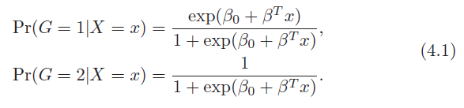
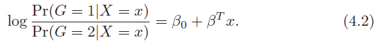
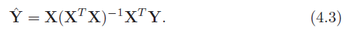
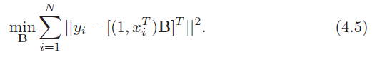
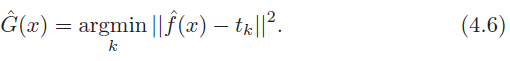
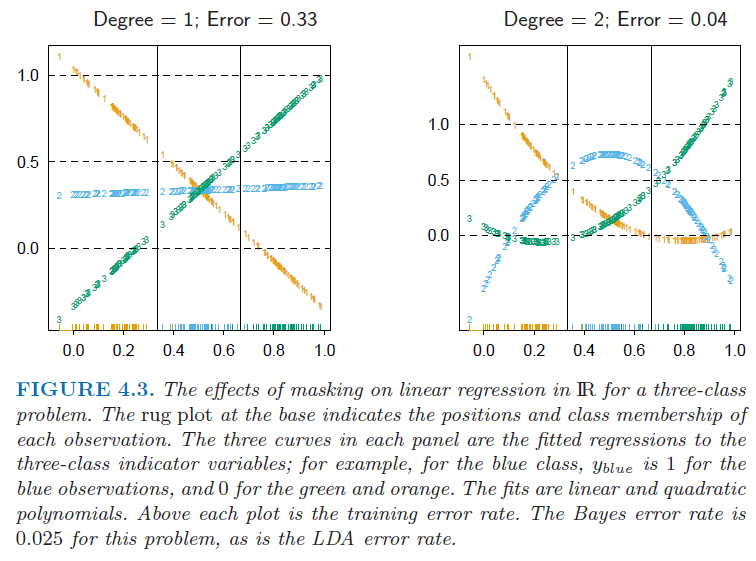

# Linear Methods for Classification

## 4.1. Introduction

해당 절에서는 linear method를 분류문제에 적용한 기법들에 대해서 알아보려고 한다. 해당 절에서 예측해야하는 변수 $G(x)$는 이산적인 $g$개의 변수를 가지고, input space를 classification에 따라 타겟 변수의 값별로 나눠보려고 한다.

분류해야하는 타겟 값에는 K개의 class가 있으며, k번째 타겟을 위한 선형 모델의 값은 $\hat{f}_k(x)=\hat{\beta}_{k0}+\hat{\beta}^T_{k}x$이다. class k와 l의 결정 경계는 $\hat{f}_k(x)=\hat{f}_l(x)$가 같아지는 지점들의 집합이고, 이는 $\{x:(\hat{\beta}_{k0}-\hat{\beta}_{l0})+(\hat{\beta}_{k}-\hat{\beta}_{l})^Tx=0\}$와 같이 나타낼 수 있다. 이로 인해, input space는 classification 된 공간으로 나눠질 수 있는 것이다. 

이러한 회귀적인 접근법은 각 클래스를 위해 모델된 discriminant functions $\delta_k(x)$로 각 discriminant function의 최대값을 가지고 x를 각 클래스로 분류한다. 사후 확률 $Pr(G=k|X=x)$로 모델링하는 모델 또한 위의 접근법에 속한다. $\delta_k(x)$ 또는 $Pr(G=k|X=x)$가 x에 대해 선형적이라면, 결정 경계 또한 선형이 될 것이다. 

따라서, 결정경계를 선형으로 하기 위해서는 $\delta_k(x)$ 또는 $Pr(G=k|X=x)$이 선형이 되도록 단조변환을 거쳐야 할 것이다. 

이를 $log[p/(1-p)]$에 대해 단조변환하게 되면, 

위의 식에서 결정경계는 4.2.의 우변의 수식을 0로 하는 값을 찾는 것이며, 이를 초평면에는 $\{x|\beta_0+\beta^Tx\}$로 정의한다. 이를 계산하는 방식에는 아래의 방법이 있다. 

* Linear Dicriminant Analysis
* Linear Logistic Regression

이 둘의 가장 중요한 차이는 훈련데이터셋에 linear function을 학습하는 방법이다. 

## 4.2. Linear Regression of and Indicator Matrix

결과 값으로 나온는 class들을 'indicator variable'이라고 하자. 만약 $g$가 K개의 클래스를 갖는다면, $k=1,...,K; Y_k$의 indicator가 있고 만약 특정 Row의 target G=k이면 1 아닌 경우에는 0의 값을 가진다. 이를 벡터 Y로 하여 $(Y_1,...,Y_K)$로 나타내면, Y는 N개의 train data를 가지는 경우에 0과 1로 구성된 NXK 행렬로 나타난다. 

Y가 K개수의 class만큼 늘었기 때문에, 추정해야하는 coefficieint Beta의 값 또한 (p+1) X K 행렬로 나타난다. 

* 4.3.의 식으로 추정한 estimator에 따른 수식은 $\hat{f}(X)^T = (1,x^T)\hat{B}$
* 각 row 별로 k 클래스의 $\hat{f}(X)^T$ 중에 가장 큰 값을 예측값이라고 하면, 예측한 결과값을 아래와 같이 나타낼 수 있다. 

    $\hat{G}(x)=argmax_{k\in{g}}\hat{f}_k(x)$ (4.4)

조건부 기대값을 추정하는 회귀방법으로 문제를 바라본다면, 랜덤변수 $Y_k$에 대해 $E(Y_k|X=x) = Pr(G=k|X=x)$이며, 이 또한 적절한 목표가 될 수 있다. 이 방식의 논점은 rigid linear regression model보다 더 우수한지 질문에 답하는 것이다. 

이는 각 예측치에서 얻는 1값이 무조건 하나인 $\sum_{k\in{g}}\hat{f}_k(x)=1$로 인해 쉽게 검증할 수 있다. 그러나 결과값이 음수이거나 1개 이상의 1이 있다면 다른 우수한 방법이 있을 것이다.

만약 인풋의 기저의 확장인 h(X)위에 선형 회귀를 할 수 있다면, 확률의 추정치들을 지속적으로 이끌어 낼 수 있다. 훈련 데이터의 개수 N이 늘어날수록, 이러한 기저함수위에 선형회귀가 조건부 평균에 접근할 수 있도록 더 많은 기저 항목들을 포함해야 한다. 

간단한 방법으로, 각 클래스에 대해 K X K target 단위행렬을 생성하고 이에서 k번째 컬럼값인 tk를 활용하는 것이다. prediction의 목표는 관측치에서 적절한 target의 추정치를 만들어 내는 것이다. 이는 $g_i=k$이면 $y_i=t_k$가 된다. 

* fit the linear model by least square

    

    
    

fit된 vector로 새 관측값을 분류하게 되면,

regression approach의 심각한 단점은 예측하고자하는 클래스 값이 3개 이상인 경우이다. 회귀 모델의 엄격성으로 인해 클래스는 상호간에 겹쳐질 수 있다. 

각각의 3클래스의 데이터를 x축에 투영하면 각각 3개의 중심점을 가진다. 각각의 클래스들의 respond를 Y1,Y2,Y3로 나타낸다. 좌측 이미지의 2번째 클래스의 선은 수평이고 fitted value는 never dominant이다. 그래서 class 2값은 1 또는 3의 값으로 매핑될 것이다. 우측 이미지는 2차식의 회귀선이다. 이는 선형 회귀선과 다르게 문제를 해결할 수 있다. 만약 우측 이미지에서 4개의 클래스로 변화하는 경우 optimal한 경우를 찾기 위해서는 3차식의 변형 또한 고려해야 할 것이다. 

그래서 class의 수 K가 3이상이라면 K-1 수준의 polynomial feature를 생성해야 이를 해결할 수 있을 것이다. 

이를 p차원의 input 값, K개의 class로 일반화하게 되면, K-1, $O(p^{K-1})$의 수준과 복잡도를 해당 문제를 해결하는데 소요된다. 

### 4.3. Linear Discriminant Analysis

#### References

<a href="https://ratsgo.github.io/machine%20learning/2017/03/21/LDA/">https://ratsgo.github.io/machine%20learning/2017/03/21/LDA/</a>